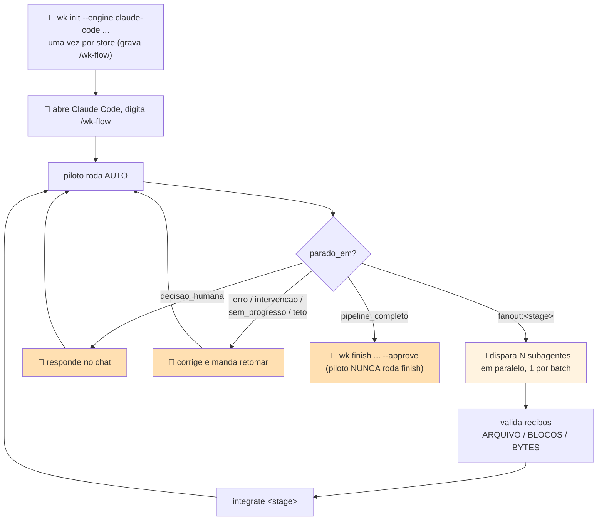

# Wiki AI — Guia de operação

Dois fluxos principais (`analyze` para codebase, `ingest` para fontes) mais setup, atualização, consulta e migração. Cada um é uma tabela sequencial: você executa a linha, confere o sinal de "deu certo quando", passa para a próxima. O fluxo legado (§6) continua funcionando e está marcado como tal. Referência técnica, guardrails e catálogo de erros ficam nas seções 7–9 — fora do caminho.

---

## 0. Antes de começar

### Legenda

| Símbolo | Quem | O que significa |
|---|---|---|
| 👤 | humano | executa o comando no terminal. Tudo que é determinístico é do humano |
| 🤖 | LLM | **no fluxo principal, o próprio `wk` despacha a engine** (`--engine local\|claude-cli`) — não existe prompt para colar. O modo colar-prompt (abrir uma sessão de agente COM ACESSO AO DISCO desta máquina e colar o texto impresso pelo `wk`) existe **somente no fluxo legado** (§6) |

No fluxo principal (§2–§5) não há passo 🤖 nenhum: `wk analyze`/`wk ingest`/`wk update` fazem a análise estrutural determinística sozinhos e, se e só se a engine estiver disponível, despacham a leitura adicional por dentro. Engine indisponível **não trava** — a análise estrutural termina e o motivo sai em `bloqueios[]` (§7.7).

### Duas coisas diferentes chamadas `--engine`

| Comando | Valores aceitos | O que significa |
|---|---|---|
| `init` · `check` · `doctor` | `claude-code` · `antigravity` · `devin` · `copilot` · `all` (vírgula p/ vários) | qual assistente de código recebe skill/permissões/slash command em disco |
| `analyze` · `update` · `resume` | `local` · `claude-cli` | quem executa o despacho das tarefas de investigação. `local` = worker estrutural embutido, sem LLM. `claude-cli` = binário `claude`, sondado antes de usar |

### Variáveis usadas em todos os comandos

```bash
WKPY="python"
WK="C:/Users/User/projetos/wiki-ai/wk.pyz"
WK_STORE="C:/caminho/do/store"
WK_REPO="C:/caminho/do/repo"
WK_TOPIC="codebases/nome-do-repo"
```

`--store` pode ser omitido em todo comando do fluxo principal se `WK_STORE` estiver no ambiente.

---

## 1. FLUXO 0 — Setup (uma vez por máquina)

| P# | Quem | O que fazer | O que acontece | Deu certo quando |
|---|---|---|---|---|
| P1 | 👤 | `$WKPY "$WK" doctor --store "$WK_STORE" --repo "$WK_REPO" --engine claude-code` | diagnostica shell, python, `wk` (+ frescor do `.pyz`), store, repo, engine | lista de `bloqueios` (pode vir cheia — é o retrato inicial) |
| P2 | 👤 | `$WKPY "$WK" init --engine claude-code --store "$WK_STORE" --repo "$WK_REPO"` | materializa a skill em disco, grava as permissões da engine **e** o slash command `/wk-flow` (`.claude/commands/wk-flow.md`, para `--engine claude-code`) — a entrada do FLUXO 3 legado | JSON com `permissoes[]` preenchido e `comando_wk_flow: {"status": "criado", "caminho": ...}` |
| P3 | 👤 | `$WKPY "$WK" store init "$WK_STORE"` | cria `inbox/`, `raw/`, `wiki/`, `log.md`, `quarantine.md` | `criados[]` preenchido |
| P4 | 👤 | `$WKPY "$WK" doctor --store "$WK_STORE" --repo "$WK_REPO" --engine claude-code` | rediagnostica; acusa `/wk-flow` ausente/desatualizado (com `acao`) na mesma chave `comando_wk_flow`, agora no formato `{"ok": ..., "problemas": [...]}` | **`bloqueios: []`** |

`knowledge.db`, `runtime.db`, `publicacoes/` e `.analysis/` **não** são criados por `store init` — nascem na primeira `wk analyze`/`wk ingest` (§7.7).

### Quando o `doctor` acusa `.pyz` desatualizado

| Onde | Sinal | O que fazer |
|---|---|---|
| `wk.pyz.pyz_desatualizado: true` (+ `acao`) | o hash da fonte embutida no `.pyz` não bate com o `scripts/` ao lado | 👤 `python scripts/build_pyz.py` — reempacota `wk.pyz` a partir de `scripts/` |
| `wk.pyz.fonte_disponivel: false` | não há `scripts/` ao lado do `.pyz` (instalação só com o binário) | nada a fazer; é o estado normal de quem só tem o `.pyz` |

É **diagnóstico**: nunca vira `bloqueio` nem muda o exit code do `doctor`.

---

## 2. FLUXO PRINCIPAL — Analisar uma codebase

Um comando faz o pipeline inteiro: snapshot → inventário → extração → capacidades → objetivos → tarefas (`runtime.db`) → despacho (se a engine despachar) → revisão em `knowledge.db` → publicação real em `store/publicacoes/`. **Zero passos de LLM colada.**

| P# | Quem | O que fazer | O que acontece | Deu certo quando |
|---|---|---|---|---|
| P1 | 👤 | `$WKPY "$WK" analyze --repo "$WK_REPO" --store "$WK_STORE" --topic "$WK_TOPIC" --engine local` | roda o pipeline inteiro e publica `markdown/` + `word/` + `manifest.json` | exit **0**; `revisao.revision_id` preenchido; `publicacoes.revisao` igual a ele; `bloqueios: []` |
| P2 | 👤 | `$WKPY "$WK" status --repo "$WK_REPO" --store "$WK_STORE"` | lê `runtime.db` + `knowledge.db`: tarefas por estado, revisão corrente, lacunas, efeitos pendentes | `tarefas_por_estado` sem `pending`/`running` presos; `efeitos_pendentes: []` |
| P3 | 👤 | só se P1 trouxe `bloqueios[]` ou P2 mostrou tarefa parada: `$WKPY "$WK" resume --repo "$WK_REPO" --store "$WK_STORE"` | libera leases expirados e redespacha `ready`/invalidadas | `retomada.ready`/`blocked` zerando; `bloqueios: []` |
| P4 | 👤 | abrir `"$WK_STORE"/publicacoes/markdown/` (leitura) e `"$WK_STORE"/publicacoes/word/` (upload) | as duas saídas da MESMA revisão, indexadas em `manifest.json` | um `.md` e um `.docx` por unidade; `manifest.json` com `revision_id` igual ao de P1 |

`--topic` e `--engine` são gravados no perfil (`store/.analysis/profile.json`) e reaproveitados nas execuções seguintes — não precisa repetir.

### Quando `analyze` reporta `bloqueios[]`

| `bloqueios[].tipo` | Quando acontece | O que já ficou pronto | O que o humano faz |
|---|---|---|---|
| `dispatch_indisponivel` | a engine escolhida não tem despacho agora (ex.: `claude-cli` sem o binário `claude` no PATH) | análise estrutural determinística COMPLETA: entidades/relações/fatos com evidência de código, revisão gravada e publicada | configura o binário/credenciais e roda `wk resume --repo ...`; o `proximo_passo` da saída traz o comando pronto. **Não** refaça a análise |
| `engine_desconhecida` | `--engine` fora de `local`/`claude-cli` (ou engine não registrada) | idem | corrija o `--engine` e rode `wk resume` |

O bloqueio é registrado **uma vez** por execução — nunca vira laço de retentativa.

---

## 3. FLUXO PRINCIPAL — Ingerir fontes (arquivo ou diretório)

| P# | Quem | O que fazer | O que acontece | Deu certo quando |
|---|---|---|---|---|
| P1 | 👤 | `$WKPY "$WK" ingest "C:/caminho/arquivo.md" --store "$WK_STORE"` | preserva a fonte, extrai candidatos, correlaciona no `knowledge.db` e republica a revisão | exit **0**; `fontes[0].status: "ingested"`; `revisoes[]` com 1 id |
| P2 | 👤 | `$WKPY "$WK" ingest "C:/caminho/pasta" --initiative INI-42 --phase inception --store "$WK_STORE"` | mesma coisa para o diretório inteiro, **resultado por fonte**; a iniciativa/fase fica persistida para aquele diretório | uma linha em `fontes[]` por arquivo; `unidades_afetadas[]` preenchido |
| P3 | 👤 | conferir `avisos[]` da saída | `fontes[].diagnostico` (falha isolada) e `fontes[].decisoes_pendentes` (iniciativa ambígua) | `avisos: []`, ou avisos lidos e aceitos (nenhum deles bloqueia) |

### Formatos com adapter nativo

`.md` · `.markdown` · `.mdown` · `.txt` · `.text` · `.docx` · `.docm` · `.pdf` · `.html` · `.htm` · `.xhtml` · `.json` · `.jsonl` · `.xml` · `.xmi` · `.xsd` · `.wsdl` · `.rels` · `.srt` · `.vtt` — mais **diretório** (recursivo). Formato sem adapter é preservado com proveniência (entidade + hash) e sai com `diagnostico` explicando que não houve extração de conteúdo.

### Contrato por fonte (`fontes[]`)

| Chave | Quando aparece | Significa |
|---|---|---|
| `status` | sempre | status honesto do adapter (`ingested`, `partial`, …) — é ele que decide o exit code do lote, não o resultado da correlação |
| `candidatos` | sempre | quantos candidatos a fato foram extraídos |
| `correlacionadas` | sempre | fatos + arestas efetivamente gravados no `knowledge.db` |
| `orfaos` | quando > 0 | candidatos que não encontraram unidade correspondente |
| `duplicada` | quando `true` | mesmo conteúdo já ingerido (mesmo `svid`) — reingestão **não** duplica |
| `decisoes_pendentes[]` | quando há ambiguidade | `key` · `question` · `options[]` · `material_effect`. **Aceita sem bloqueio**: a ingestão termina, a decisão fica registrada |
| `diagnostico` | quando a fonte falhou | `causa` · `impacto` · `correcao_tentada` · `decisao_necessaria`. Falha isolada **não** derruba o lote |
| `indisponivel` | quando o adapter não conseguiu ler | o motivo declarado pelo adapter |

Precedência de `--initiative`/`--phase`: **argumento > frontmatter/metadata do arquivo > contexto persistido por diretório**. Só a referência EXPLÍCITA (argumento ou frontmatter) é persistida — para não perguntar de novo no mesmo diretório.

Exit code do lote: **0** se ao menos uma fonte saiu `ingested`/`partial`; **1** se nenhuma.

---

## 4. FLUXO PRINCIPAL — Atualizar e consultar

### 4.1 Atualização incremental

| P# | Quem | O que fazer | O que acontece | Deu certo quando |
|---|---|---|---|---|
| P1 | 👤 | `$WKPY "$WK" update --repo "$WK_REPO" --store "$WK_STORE"` | compara o snapshot atual com o da última `analyze`/`update`; **só o delta** é reanalisado | sem mudança: `{"mudou": false, "mensagem": ..., "snapshot_id": ...}` e **nada** foi republicado |
| P2 | 👤 | quando `mudou: true`, conferir `delta` e `objetivos_invalidados` | `delta.adicionados`/`removidos`/`alterados` + o que foi invalidado e reexecutado | `revisao.revision_id` NOVO e `publicacoes.revisao` igual a ele |

`update` exige que o mesmo `--repo` já tenha passado por `analyze`; senão sai com exit **2** e `acao` trazendo o `wk analyze` pronto.

### 4.2 Consulta

| P# | Quem | O que fazer | O que acontece | Deu certo quando |
|---|---|---|---|---|
| P1 | 👤 | `$WKPY "$WK" status --repo "$WK_REPO" --store "$WK_STORE"` | estado da análise: `ultimo_snapshot`, `tarefas_por_estado`, `capacidades_obsoletas`, `revisao`, `lacunas[]`, `efeitos_pendentes[]` | JSON com a revisão corrente |
| P2 | 👤 | ler `"$WK_STORE"/publicacoes/markdown/` | leitura humana da revisão publicada | um `.md` por unidade |
| P3 | 👤 | `$WKPY "$WK" index reindex --store "$WK_STORE"` | indexa `raw/`+`wiki/` (corpus legado); poda o que sumiu | `documents`/`changed`/`pruned`/`embedded` no JSON |
| P4 | 👤 | `printf 'intent: como funciona o retry\nlex: retry dead-letter\n' \| $WKPY "$WK" index search -c wiki -n 5 --format json --store "$WK_STORE"` | busca híbrida | `results[]` com os docids |
| P5 | 👤 | `$WKPY "$WK" index get "<docid>" --store "$WK_STORE"` | recupera o documento/trecho | conteúdo no stdout |

O `index` opera sobre `raw/`/`wiki/` (corpus **legado**), não sobre `knowledge.db`. A consulta ao conhecimento novo é `wk status` + as publicações.

### 4.3 Saída para SharePoint / Copilot Studio

| Pasta | Para quê |
|---|---|
| `store/publicacoes/word/` | **upload manual** no SharePoint. É a pasta pronta: um `.docx` por unidade publicada da revisão corrente |
| `store/publicacoes/markdown/` | mesma revisão em Markdown, para leitura/diff |
| `store/publicacoes/manifest.json` | índice `unit_id → {md_path, docx_path, content_hash, fact_ids[], state}` + `revision_id` e `previous_revision` |
| `store/publicacoes/.history/<revision_id>/` | snapshot completo (markdown + word + manifest) de cada revisão anterior — é o material de rollback |

Não existe comando `wk` que fale com SharePoint ou Copilot Studio: o upload é 👤, manual, a partir de `word/`.

---

## 5. FLUXO PRINCIPAL — Migrar o corpus legado

Leva `raw/`, `wiki/` e os artefatos SDD de `.codescan/` para o `knowledge.db`, com **backup imutável obrigatório** antes de qualquer escrita.

| P# | Quem | O que fazer | O que acontece | Deu certo quando |
|---|---|---|---|---|
| P1 | 👤 | `$WKPY "$WK" migrate --store "$WK_STORE" --backup-dir "C:/caminho/backup-novo"` | inventário → backup → migração → verificação, nessa ordem | exit **0** e `verificacao.ok: true` |
| P2 | 👤 | conferir `backup` na saída | `dir` · `manifesto` · `arquivos` · `bytes` | o diretório existe com o `manifest.json` |
| P3 | 👤 | conferir `inventario` × `migrados[]` × `pulados[]` | por categoria: `curated_source`, `derived_output`, `log` | `pulados: []` (ou pulos conhecidos e aceitos) |

- `--backup-dir` precisa ser **novo ou vazio**. Reusar um diretório já preenchido sai com exit **2** e `backup falhou: backup_dir já existe e não está vazio` — o backup é imutável, um por execução. Sem `--backup-dir`, o `wk` gera um sozinho sob `<store>/.migrate-backup/`.
- **Naturezas na migração**: todo fato importado do corpus legado nasce `observed` ou `declared_requirement`. **Nunca** `implemented`, **nunca** `supported` — importar texto não é verificar. A própria `verify_migration` rejeita o resultado se algum fato migrado vier com essas naturezas (`verificacao.fatos_proibidos`).
- Rodar de novo é seguro: a migração é idempotente por conteúdo (`changed: false` no que não mudou), mas exige um `--backup-dir` novo a cada vez.

---

## 6. LEGADO — em migração

Continua funcionando, sem mudança de comportamento. **Emitem `aviso_migracao` no JSON**: `ingest-legacy`, `finish` e todo `wk code <sub>`. `promote`, `compile`, `docx`, `lint` e `publish` **não** emitem o aviso (são passos compartilhados).

| Fluxo legado | Comandos | Equivalente novo |
|---|---|---|
| FLUXO 1 — ingerir texto | `ingest-legacy` → `promote` → `compile` → `index reindex` → `lint` | `wk ingest <arquivo>` (§3) |
| FLUXO 2 — ingerir binário | `ingest-legacy` (guarda o asset) → 🤖 análise colada → `ingest-legacy --source-type agent-output --derived-from <id>` → `promote` → `compile` | `wk ingest <arquivo.docx\|.pdf>` (§3) — adapter nativo, sem passo 🤖 |
| FLUXO 3 — ingerir codebase | `/wk-flow` (piloto) ou `code auto` + fan-out + `integrate`, fechando com `finish --approve` | `wk analyze --repo` (§2) |
| FLUXO 4 — consultar | `index status`/`reindex`/`search`/`get` | continua válido para `raw/`/`wiki/` (§4.2) |
| FLUXO 5 — auditoria | `index audit` + `lint` | integridade do conhecimento novo: `wk status` (`lacunas[]`) + `migrate` (`verificacao`) |

### 6.1 FLUXO 1/2 legados (texto e binário)

| P# | Quem | O que fazer | Deu certo quando |
|---|---|---|---|
| P1 | 👤 | `$WKPY "$WK" ingest-legacy "C:/caminho/arquivo.md" --source-type human-transcript --origin "reunião 2026-08-07" --topic pagamentos --store "$WK_STORE"` | JSON com `id`, `path`, `source_type`, `aviso_migracao` |
| P2 | 👤 | `$WKPY "$WK" promote --approve-all --source-type human-transcript --topic pagamentos --approved-by "seu-nome" --store "$WK_STORE"` | `promovidos[]` preenchido, sem `duplicados[]` |
| P3 | 👤 | `$WKPY "$WK" compile pagamentos --store "$WK_STORE"` | `paginas[]` preenchido, `recusados` ausente |
| P4 | 👤 | `$WKPY "$WK" index reindex --store "$WK_STORE"` | `documents`/`changed`/`pruned`/`embedded` |
| P5 | 👤 | `$WKPY "$WK" lint --store "$WK_STORE"` | `achados: 0` (ou achados conhecidos e aceitos) |

Binário (`.xlsx`/`.csv`/`.pdf` no caminho legado): o original é guardado imutável em `raw/assets/<id>.<ext>` (JSON traz `id` **e** `asset`), a análise é escrita por LLM à parte e reingerida com `--source-type agent-output --derived-from "<id-do-asset>"`. É `--derived-from` que alimenta o `L4_realimentacao` do `lint` e o gate `realimentacao` do `promote` (§7.6).

### 6.2 FLUXO 3 legado — modo piloto

O caminho principal do FLUXO 3 é o **modo piloto**: uma LLM despachante (Claude Code, via slash command) roda o pipeline inteiro sozinha, do primeiro `surface` ao `pipeline_completo`, e só devolve o controle ao humano em decisão-chave ou falha.

Por baixo é a máquina de estados de 8 etapas (`surface → modules → rules → architecture → specs → evidence → synth → verify`) com os gates de §7.3. `wk code auto` é o motor: encadeia as ações determinísticas e para em `fanout:<stage>` porque o próximo passo é conteúdo escrito por LLM.



| P# | Quem | O que fazer | O que acontece | Deu certo quando |
|---|---|---|---|---|
| P1 | 👤 | `$WKPY "$WK" init --engine claude-code --store "$WK_STORE" --repo "$WK_REPO"` — uma vez por store | grava permissões + `/wk-flow` | `permissoes[]` preenchido e `comando_wk_flow.status: "criado"` |
| P2 | 👤 | abrir uma sessão Claude Code e digitar `/wk-flow` | o piloto roda `code auto` em laço: dispara os subagentes de cada fan-out em paralelo, valida os recibos, roda `integrate`, revalida com `auto` | a sessão avança estágio a estágio até parar numa linha da tabela abaixo |
| P3 | 👤 | quando parar em `decisao_humana`: responder no chat (tópico / `doc_level` / `granularity` / unidades de `specs`) | o piloto embute a resposta no próximo `auto` | novo `parado_em` diferente de `decisao_humana` |
| P4 | 👤 | quando parar em `pipeline_completo`: rodar o `wk finish --workdir <workdir> --topic "$WK_TOPIC" --repo "$WK_REPO" --store "$WK_STORE" --approved-by "seu-nome" --approve` que o piloto entrega no campo `acao` | `evidence` → `verify` → `audit` → `publish` → `promote --approve-all` → `compile` → `index reindex` → `lint` (+`docx`) | exit **0**, `passos[]` todo `status: "ok"` (`lint`/`docx` podem sair `"aviso"` sem abortar) |

Quem não usa Claude Code: `wk code pilot --store "$WK_STORE" --repo "$WK_REPO"` imprime o mesmo protocolo como prompt-mestre para colar; `--command-file` imprime o conteúdo exato do slash command.

### 6.3 FLUXO 3 legado — paradas e retomada

| Parada | Quando acontece | O que o humano faz |
|---|---|---|
| `decisao_humana` (exit 0) | falta tópico, `doc_level`+`granularity`, ou unidades de `specs` | responde no chat; no modo manual, a `acao` traz a flag que resolve |
| `fanout:<stage>` (exit 0) | o próximo passo é conteúdo de LLM | piloto: dispara os subagentes. Manual: cola o prompt impresso numa sessão com acesso ao disco |
| `pipeline_completo` (exit 0) | todos os estágios SDD fechados | roda o `wk finish ... --approve` que vem pronto na `acao` |
| `limite_de_acoes` (exit 0) | teto de 30 ações numa invocação do `auto` | rode `auto` de novo |
| `erro` (exit 2) | uma ação falhou pela 1ª vez com esta assinatura | corrija e rode `auto` de novo |
| `intervencao` (exit 2) | a MESMA falha 2x seguidas na MESMA etapa | corrija pelos `comandos_redo` do payload e rode `auto --retry` |
| `sem_progresso` (exit 2) | a ação saiu 0 sem mover a máquina de estados | rode `state`/`next` e investigue |
| teto de 40 ações do piloto | proteção contra laço da LLM despachante | revisa o `progresso`; digita `/wk-flow` de novo |

`code auto` é *stateful*: o checkpoint vive em `state.json`, dentro do workdir (`$WK_STORE/.codescan/<repo>-<hash>`). Sessão caiu → digite `/wk-flow` de novo, o piloto reencontra o ponto exato. Commit do repo mudou desde o `surface` → `verify` acusa `drift_detectado: true`; `code drift` lista `arquivos_alterados`/`artefatos_afetados` e o `redo` por item. Refazer 1 item: `code redo <stage> --item <item>`. Item impossível: `code blocked <stage> --item <item>` (ou `failed`, `degraded`).

Toda saída de `auto` carrega também `executados[]` (o que ESTA invocação rodou) e `progresso` (`"etapa <i> de 8 — fase <...>"`).

**Proibido abrir `wk.pyz` com zipfile/decompilação para entender um erro.**

---

## 7. Referência técnica

### 7.1 Contrato entregue à LLM (fluxo legado)

`compact_contract` — fonte de verdade em runtime: `code sdd-brief <stage>`. São os limites **informados no prompt**, não os gates que decidem sucesso/falha (§7.3).

| Estágio | Bloco | Ids aceitos | Máx linhas/bloco | Seções exigidas |
|---|---|---|---|---|
| modules | `=== MODULE: <path> ===` (e `=== FAILED MODULE: ... ===`) | paths do batch | 56 | Responsabilidade · Estruturas de dados · Fluxos · Dependencias · Rastreabilidade · Lacunas |
| rules | `=== RULES: <id> ===` | `domain` · `state-machines` · `permissions` · `adrs/NNN-<slug>` | 80 | Regras · Estados · Permissoes · Contradicoes · Lacunas |
| architecture | `=== ARCHITECTURE: <id> ===` | `architecture` · `c4-context` · `c4-containers` · `c4-components` · `erd-complete` · `traceability/spec-impact-matrix` · `sequences/<slug>` | 90 | Containers · Integracoes · Decisoes · Riscos · Rastreabilidade |
| specs | `=== SPEC: <unit> ===` (**SPEC singular**) | units do `pending` + `confidence-report` · `gaps` · `traceability/code-spec-matrix` · `user-stories/<slug>` · `openapi/<slug>` | 70 (por arquivo) | Requisitos · Criterios · Design · Tarefas · Testes · Rastreabilidade · Lacunas |
| synth | `=== SYNTH: <id> ===` | `confirmed` · `inferred` (não use `=== CONFIRMED: ===`) | 80 | Confirmados · Inferidos · Perguntas |
| evidence | `=== EVIDENCE: <id> ===` (e `=== FAILED EVIDENCE: ... ===`) | tópico do evidence-pack | 50 | Escopo · Arquivos · Citacoes · Lacunas |

Todo bloco fecha com `=== END ===`. Em `specs`, o corpo da unit é dividido por `--- requirements.md ---`, `--- design.md ---`, `--- tasks.md ---` (e, em `doc-level detalhado`, os opcionais `--- contracts.md ---` e `--- edge-cases.md ---`).

Globais do `compact_contract`: 8 seções por artefato · 8 bullets por seção · 0 linhas de código · sem preâmbulo, sem resumo, sem diff. Marcadores obrigatórios: 🟢 confirmado · 🟡 inferido (com justificativa) · 🔴 desconhecido (com pergunta objetiva). Mermaid obrigatório em `architecture` (`flowchart`/`graph`), `c4-*` (`flowchart`/`graph`/`C4Context`/`C4Container`/`C4Component`) e `erd-complete` (`erDiagram`); sem diagrama, `<!-- no-diagram: <motivo> -->`.

### 7.2 Regras de citação, id de bloco e entidades

**Citação (literal no prompt de despacho):** todo bullet 🟢 confirmado exige citação com caminho relativo COMPLETO a partir da raiz do repo, com `/`, exatamente como em `evidence[].path` do pack, seguido de `:linha`. Válido: `quote-service/src/main/java/br/com/acme/insurance/quote/domain/event/DomainEvent.java:5`. Inválido: `DomainEvent.java:5` (basename — reprovado no gate de `verify`/`audit`; vira `caminho_parcial` se o basename casar com exatamente 1 arquivo do repo, `arquivo_inexistente` caso contrário).

**Id de bloco `MODULE`:** o `<id>` tem que ser o path do item do batch (o mesmo que está em `pending` / no `modules-batch-NN.json`). Encurtamento por SUFIXO ÚNICO é mapeado automaticamente; sufixo ambíguo ou id fora do batch vira erro no merge — `id de bloco fora do batch do plano`, com a lista dos ids válidos. `FAILED MODULE` segue a mesma regra.

**Estruturas de dados (bloco `modules`):** nomes de entidade/tipo vão entre crases (ex.: `` `Quote` ``) — não conta como eco de código (a proibição cobre trecho/linha, não identificador entre crases). Alimenta `sdd/data-dictionary.md`, extraído automaticamente no merge de `modules`.

### 7.3 Gates de integridade × avisos cerimoniais

Todo resultado de auditoria agora carrega `criterio: "integridade"`. **Só integridade reprova**: citações conferidas contra o disco, paths, proveniência, hashes. Cerimônia (tamanho, contagem de seções, idioma, existência de artefato de rito) virou `avisos_cerimoniais[]` — visível, nunca decisivo, e **fora do cálculo de score**.

**Bloqueiam (`blockers[]`, reduzem score, reprovam `done`/`audit`/`verify`):**

| Gate | Onde | Critério |
|---|---|---|
| Citações insuficientes | merge / audit | menos que o `min_citations` da regra do artefato |
| Citação não confere com o repositório | merge / audit | amostra determinística (até 5 por artefato, sorteada pelo hash do conteúdo) validada contra o disco real com a MESMA lógica de `evidence._citation_error` — arquivo existe, caminho relativo completo, dentro do repo, linha dentro do arquivo |
| Placeholder pendente | merge / audit | marcador de boilerplate na prosa fora de fences ``` |
| Escala de confiança ausente | merge / audit | nenhum 🟢/🟡/🔴 num artefato que exige citações |
| Fallback/falha operacional no artefato | merge / audit | o artefato descreve a própria falha em vez do sistema |
| Detalhamento operacional insuficiente | merge / audit | < 4 bullets/linhas de tabela ou < 2 marcadores operacionais |
| Artefato genérico | merge / audit | conteúdo sem substância verificável além de frases padrão |
| Mermaid inválido | merge / audit | erro de sintaxe/label não quoted; `quadrantChart` com rótulo técnico frágil |
| Diagrama obrigatório ausente | merge / audit | só para artefatos **fora** de `CEREMONIAL_RULES` (`architecture.md`, `c4-*`) |
| Score ≥ 90 | merge / audit | `MIN_DONE_SCORE = 90`; o score só é reduzido pelos itens desta tabela |
| Fan-out real | merge | N agentes distintos quando o estágio tem mais de 1 batch |
| Artefatos obrigatórios | merge | o `doc-level` define o mínimo (`essencial` < `completo` < `detalhado`) — travado antes do fan-out |
| Proveniência sha256 | merge | sha256 do run registrado em `agent-runs/` |
| Cobertura por artefato | verify | `stages.verify.artifacts`; `sdd/confirmed.md` sempre exigido, `sdd/inferred.md` só se existir no workdir |
| Drift | verify / drift | commit pinado em `surface.json` (`git.head`) mudou → citação para arquivo alterado vira ERRO `drift_detectado`; drift que não toca arquivo citado é warning |
| Compactação de output | merge | máx. 220 linhas por batch, ajustável por `WK_AGENT_OUTPUT_MAX_LINES` |

**Informam (`avisos_cerimoniais[]`, nunca bloqueiam, não entram no score):**

| Aviso | Quando |
|---|---|
| `tamanho abaixo do sugerido em <arq>` | bytes < `min_bytes` da regra |
| `seção sugerida ausente: <seção> em <arq>` | heading esperado não encontrado |
| `provável saída em inglês em <arq>` | marcadores EN ≥ 2× PT-BR **e** ≥ 8 no total |
| `ausente (informativo, não bloqueia — §3.1): <regra>` | artefato de `CEREMONIAL_RULES` não existe |
| diagrama ausente em artefato de `CEREMONIAL_RULES` | ex.: `state-machines.md`/`erd-complete.md` sem Mermaid |

`CEREMONIAL_RULES` (a lista exata em código): `sdd/adrs/*.md` · `sdd/user-stories/*.md` · `sdd/state-machines.md` · `sdd/erd-complete.md` · `sdd/sequences/*.md` · `modules/*.md`.

Quando o artefato de `CEREMONIAL_RULES` **existe**, as checagens de integridade acima valem para ele normalmente. E quando outro blocker real recusa o mesmo `done`, os `avisos_cerimoniais` continuam no JSON de erro — nunca escondidos, só nunca decisivos sozinhos.

### 7.4 Verify e evidence (verificação real, não `done` manual)

| Regra | Onde | Comportamento |
|---|---|---|
| `done verify` é sempre recusado | `code done verify` | exit **2**: "o status de verify é derivado da cobertura de artefatos obrigatórios, não de um done manual". Só `code verify --artifact <path>` fecha o estágio, recalculando a cobertura |
| `done evidence` exige verificação registrada | `code done evidence` | exit **2** se não houver `verified` gravado (`nenhuma verificação registrada para 'evidence'`) ou se algum sha256 gravado não bater com o disco (`artefato(s) alterado(s)/ausente(s) desde a verificação`) |
| Editar o artefato invalida na invocação seguinte | qualquer `wk code <sub>` | `revalidate_verified_stages` roda no início de TODA invocação do codescan e derruba `evidence`/`verify` de `done` para `failed` quando o conteúdo mudou desde a verificação |
| Gates do `wk` revalidam antes de decidir | `promote` · `compile` · `docx` (e `finish`, que os chama) | o gate de verify chama `revalidate_verified_stages(wd)` **antes** de ler o status — nunca decide sobre um "done" congelado |

### 7.5 Comandos atômicos de controle fino (legado)

| Comando | Substitui, dentro de | Para quê |
|---|---|---|
| `code run <stage>` | `auto` (só a preparação de 1 fan-out) | prepara packs + `<stage>-contract.json` + manifesto e imprime o prompt de despacho |
| `code integrate <stage> [--partial]` | `auto` (só a integração) | integra **todos** os batches do manifesto (pelo `agent_slot`) + `done <stage>`; `--partial` integra só os batches cujo output já existe |
| `code run-stage <stage>` | `run <stage>` (1ª metade) | gera packs + manifesto + contrato, sem imprimir o prompt |
| `code handoff <stage>` | `run <stage>` (2ª metade) | reimprime o prompt de despacho de um `run-stage` já feito |
| `code merge-agent-output <stage> --input <arq> --agent <slot>` | `integrate` (1 batch por vez) | integra um batch específico, sem rodar `done` |
| `code done <stage>` | `integrate` (só o fechamento) | fecha o estágio depois de mergear todos os batches à mão |
| `code evidence --topic <t>` + `code done evidence` | `auto`/`finish` (passo evidence) | gera o evidence-pack e fecha o estágio (§7.4) |
| `code auto --retry` | — | zera o contador de tentativas do loop de erro depois de corrigir uma `intervencao` |
| `code pilot [--command-file]` | modo piloto (`/wk-flow`) | só GERA TEXTO: prompt-mestre do protocolo, ou o conteúdo exato de `.claude/commands/wk-flow.md` |
| `code verify --artifact <path>` | `finish` (passo verify) | roda a verificação isolada contra um artefato |
| `code audit` | `finish` (passo audit) | auditoria P0 do workdir |
| `code drift` | — | commit pinado × HEAD atual; artefatos afetados + `redo` por item |
| `code redo <stage> [--item <item>]` | — | refaz 1 item (ou reabre todos os `current` do stage); arquiva o anterior em `agent-runs/superseded/<run-id>/` |
| `code agent-pack <stage> --batch N` | `run-stage` (1 pack por vez) | pacote determinístico de 1 batch, sem copiar o repo |
| `code sdd-scaffold <stage>` | — | cria o esqueleto dos artefatos SDD do estágio |
| `code cleanup` | — | apaga o clone de um repo remoto, depois do término |
| `code next --quiet` / `code state --quiet` | — | diagnóstico: qual o próximo passo / onde parei |
| `publish --workdir ... --topic ...` | `finish` (passo publish) | só publica em `inbox/` |
| `promote --approve-all --source-type ... --topic ... --approved-by ...` | `finish` (passo promote) | só promove |
| `compile "$WK_TOPIC" --store "$WK_STORE"` | `finish` (passo compile) | só recompila a wiki do tópico |

- `audit --strict` é aceito, mas `--strict` é no-op: os gates P0 já são padrão.
- `publish` nunca bloqueia por `verify` reprovado — só anota `aviso_verify`. O bloqueio real é em `promote`/`compile`/`docx`. Para seguir mesmo assim: `--allow-unverified` (decisão 👤).
- `merge-agent-output`/`integrate` recusam `--agent` genérico (`main`, `self`, `principal`, `orquestrador`, `orchestrator`) — use o `agent_slot` do batch (`modules-b01`).
- `merge-agent-output --input` recusa arquivo com `mtime` anterior ao `agent-runs/<stage>-plan.json`.
- Sem `pending`, `rules`/`architecture`/`synth` viram **1 batch único** (`fanout_required: 1`). Em `specs` isso geraria uma unit genérica — por isso `pending`/`--specs-items` é obrigatório lá. Em `modules`, quem popula o pending é o `plan` (que exclui módulos de teste por padrão; `--include-tests` os traz de volta).
- A preparação do fan-out só prepara e imprime o prompt; **nunca gera conteúdo**.

### 7.6 Omissões — guardrails que não têm passo próprio

- **Permissão da engine é escrita, não só documentada.** `wk init --engine <e> --store <s> --repo <r>` grava, no `settings.json` da engine (`.claude/settings.json` para `claude-code`; `.agents/settings.json` para as demais), um merge idempotente em `permissions`: `additionalDirectories` com store e repo, `allow: ["Read(<store>/**)", "Read(<repo>/**)", "Bash(wk *)"]` + **`Write(<store>/.codescan/**/agent-outputs/**)`** (único ponto de escrita de agente no store) e `deny` NOMINAIS por árvore (`raw/`, `wiki/`, `inbox/`) + arquivos (`index.db*`, `log.md`, `quarantine.md`) + artefatos SDD em `.codescan/`. Settings antigos com deny amplo são migrados ao rodar `wk init` de novo (`permissoes_migradas: true`); `check`/`doctor` acusam o formato antigo com `acao`. O enforcement é **verificado** só para `claude-code`; para `antigravity`/`devin`/`copilot` é **best-effort** (`"formato": "best-effort"`).
- **`wk init` também grava o slash command do piloto.** `.claude/commands/wk-flow.md`. `init` reporta `comando_wk_flow: {status, caminho}`; `check`/`doctor` reportam `comando_wk_flow: {path, ok, problemas[], acao}`.
- **`wk doctor` audita o próprio `.pyz`** comparando o hash embutido (`_build_manifest.json`) com o recalculado do `scripts/` ao lado (§1).
- **`publish` é idempotente por `doc_id`** (`sb-publish-<repo>-<artefato>`, não hash de conteúdo): reexecutar regrava (`atualizado: true`) em vez de duplicar. Vale só para `inbox/`.
- **`export --output` não escreve em `<store>/raw` nem `<store>/wiki`.** Esses diretórios só mudam via `publish`/`promote`/`compile`.
- **`.docx` gerado por `wk docx` não pode ser reingerido** — seria proveniência falsa. A fonte é o `.md` correspondente em `raw/`. (A marcação é `dc:identifier == wk-docx-gerado` em `docProps/core.xml`.)
- **Publicação bloqueada nunca desfaz conhecimento.** `_publish_local` roda depois da revisão já gravada em `knowledge.db`; falha vira `publicacoes.bloqueios[]` + `avisos[]`, o comando continua com exit 0, e a publicação anterior segue ativa/servível (staging isolado, promoção só se tudo validar).

### 7.7 Contratos JSON do fluxo principal

Chaves reais, conferidas na saída dos comandos.

**`wk analyze`** (exit 0) — `capacidades_analisadas[]` (`objective_id`, `capability_id`, `task_id`, `reaproveitada`, `estado`) · `revisao` (`revision_id`, `mudancas`, `entidades{system,components,capabilities}`) · `publicacoes` (`revisao`, `markdown`, `word`, `manifesto`, e `bloqueios[]` quando houve) · `resultados` (`submitted`, `accepted`, `rejected`, `retried`, `blocked`, `failed`, `reused`, `cycles`) · `lacunas[]` (`objective_id`, `capability_id`, `nome`, `pendencias[]`) · `bloqueios[]` · `escopo_efetivo` (`repo`, `topic`, `engine`, `scope`, `namespace`, `store`) · `proximo_passo` (só quando há `bloqueios`).

> Não existe `parado_em` no fluxo principal — esse campo é do `wk code auto` legado (§6.3).

**`wk update`** — sem mudança: `mudou: false` · `mensagem` · `snapshot_id`. Com mudança: `mudou: true` · `delta` (`adicionados[]`, `removidos[]`, `alterados[]`) · `objetivos_invalidados[]` · `objetivos_obsoletos[]` · `conhecimento_invalidado[]` · mais as mesmas chaves de `analyze` (`capacidades_analisadas`, `revisao`, `publicacoes`, `resultados`, `lacunas`).

**`wk status`** — `repo` · `escopo_efetivo` (`topic`, `engine`, `namespace`, `scope`) · `ultimo_snapshot` · `tarefas_por_estado{}` · `tarefas_total_historico` · `capacidades_obsoletas` · `revisao` (`revision_id`, `created_at`, `author`, `reason`, `change_count`) · `lacunas[]` · `efeitos_pendentes[]`.

**`wk resume`** — `retomada` (`reusable`, `invalidated`, `released_leases`, `pending_effects`, `ready`, `blocked`) · `resultados` (mesma forma de `analyze`) · `bloqueios[]`.

**`wk ingest`** — `fontes[]` (§3) · `revisoes[]` · `unidades_afetadas[]` · `avisos[]` · `publicacoes` (ausente quando nenhuma revisão nova foi gravada).

**`wk migrate`** — `namespace` · `backup` (`dir`, `manifesto`, `arquivos`, `bytes`) · `inventario{}` por categoria · `migrados[]` (`rel_path`, `category`, `entity_id`, `fact_ids[]`, `relation_ids[]`, `changed`) · `pulados[]` · `avisos[]` · `verificacao` (`ok`, `fontes_faltantes[]`, `fatos_proibidos[]`, `divergencia_contagem`, `problemas[]`). Exit **0** só com `verificacao.ok: true`.

**Persistência criada pelo fluxo principal:**

| Caminho | Conteúdo |
|---|---|
| `store/knowledge.db` | conhecimento canônico: entidades, relações, fatos, revisões, outbox de efeitos |
| `store/runtime.db` | execuções: tarefas, estados, leases, resultados |
| `store/publicacoes/` | `markdown/` + `word/` + `manifest.json` + `.history/<revision_id>/` |
| `store/.analysis/profile.json` | perfil por repo: `topic`, `engine`, `scope`, `namespace`, `last_snapshot_id`, `last_revision_id`, `current_objective_ids` |
| `store/.analysis/snapshots/<snapshot_id>.json` | manifesto do snapshot (base do delta de `update`) |
| `store/.migrate-backup/backup-*/` | backups gerados por `migrate` sem `--backup-dir` |

### 7.8 Embeddings — espaços versionados (índice legado)

| Regra | Comportamento |
|---|---|
| Identidade do embedder | provider + model + deployment + config (**sem** dimensão, que só se conhece depois de embedar) |
| Identidade igual (ou nenhum espaço ativo) | reindex **incremental**: só os chunks sem embedding entram no espaço ativo |
| Identidade diferente (troca de modelo/deployment/config) | a coleção **INTEIRA** é reembedada num espaço novo, que nasce **inativo**; `activate_space` só roda depois que todos os chunks foram escritos, e só então há commit. Processo morto no meio = rollback implícito, nunca um espaço novo ativo pela metade |
| `index status` | `embedding_space_ativo` · `chunks_por_espaco{}` (chunk sem espaço aparece como `legado`) · `chunks_pendentes` · `chunks_legados` |
| Busca vetorial | restrita ao `space_id` ativo; comparar vetores de espaços diferentes (ou legados, `embedding_space_id IS NULL`) não mede similaridade nenhuma, mesmo com dimensões iguais por coincidência |
| Mismatch | exit **2** com `error: "embedder atual não corresponde ao espaço ativo do índice"` + `impacto` + `correcao` |
| Nenhum espaço ativo | exit **2** com `vec/hyde exigem um espaço de embeddings ativo; índice nunca reindexou com embeddings` |

### 7.9 Notas de comportamento (legado que segue válido)

- **`promote --approve-all`** exige `--source-type` + `--topic` + `--approved-by` juntos. `--approve <alvo>` aprova UM item (id ou caminho em `inbox/`) e também exige `--approved-by`. Não há aprovador default.
- **`compile`** poda página órfã de `wiki/<topic>/` por padrão (`--no-prune` desliga), sempre regrava `wiki/index.md` **global**, e reporta `recusados[]` e `podados[]`.
- **`ingest-legacy --derived-from <ids>`** grava a linhagem no frontmatter. Alimenta o `L4_realimentacao` do `lint` e o gate `realimentacao` do `promote`.
- **`wk finish` absorve `evidence`+`done evidence`** se `stages.evidence.status` ainda não é `done`; idempotente entre reexecuções. Sequência: `evidence` → `verify` → `audit` → `publish` (falha em qualquer um: exit 2 e `parado_em: "<passo>"`) → **ponto de decisão humana**: sem `--approve`, exit **3**, `parado_em: "promote"` e `pendentes[]`, nada promovido. Com `--approve`: `promote --approve-all` → `compile` → `index reindex` → `lint` → `docx`. Falha de `lint`/`docx` vira `"status": "aviso"` sem abortar. `--no-docx` pula o opcional.
- **`--doc-level` / `--granularity`** (`auto` e `config`): `essencial|completo|detalhado` · `module|endpoint|use-case|hybrid|feature|custom`. Só importam na invocação em que a decisão ainda está pendente. Mesma coisa para `--specs-items` e `--topic`.
- **`WK_AGENT_OUTPUT_MAX_LINES`**: padrão 220. Valor ausente, não-inteiro ou abaixo de 50 é ignorado e cai no padrão.
- **`reindex_modo`** — o reindex automático dentro de `promote`/`compile`/`finish` detecta sozinho as três `AZURE_OPENAI_*` (`_ENDPOINT`/`_API_KEY`/`_EMBED_DEPLOY`): todas presentes → `"completo"`; qualquer uma ausente → `"lex-only (embeddings não configurados)"`.
- **`wk search`** aceita `lex:` / `vec:` / `hyde:` por linha; texto livre de UMA linha sem prefixo recebe `lex:` automaticamente. Sem embeddings, só `lex:` funciona; para forçar léxico ao reindexar: `index reindex --lex-only`.
- **`index audit`** aplica `L1_canonico_so_de_agente`, `L2_proveniencia_ausente`, `L4_realimentacao`, `L5_supersedida_ainda_citada`. "L3" (contradição) **não é emitido por nenhum comando** — exige julgamento semântico. `lint` acrescenta `W1_link_quebrado`, `W2_wikilink_sem_pagina`, `W3_pagina_orfa`, `wiki_sem_fontes_declaradas`, `fonte_orfa`.

---

## 8. Erros comuns

### 8.1 Fluxo principal

| Erro | Comando de correção |
|---|---|
| `wk: error: unrecognized arguments: --source-type ...` (em `wk ingest`) | `ingest` foi renomeado: o comando com `--source-type`/`--origin`/`--topic`/`--derived-from` agora é `wk ingest-legacy`. O novo `wk ingest` só aceita `--initiative`/`--phase`/`--store`/`--namespace` |
| `'codebase' não é um subcomando de wk ingest` | é a operação de repositório: use `wk analyze --repo <caminho> --store <store>` (o legado é `wk code --repo ... surface --topic <slug>`) |
| `nenhuma análise encontrada (runtime.db ausente)` (`status`, exit 2) | rode `wk analyze --repo <repo>` primeiro |
| `nenhuma análise anterior encontrada para este repo` (`update`, exit 2) | mesmo `--repo` da `analyze`; se nunca analisou, rode `wk analyze` |
| `repo não encontrado: ...` (`analyze`, exit 2) | confira `--repo` (diretório existente; git ou não) |
| `origem não encontrada: ...` (`ingest`, exit 2) | confira o positional `path` (arquivo ou diretório) |
| `bloqueios: [{"tipo": "dispatch_indisponivel"}]` (`analyze`) | a engine não despacha agora; a análise estrutural JÁ terminou. Configure o binário/credenciais e rode `wk resume --repo ...` — não refaça a análise |
| `bloqueios: [{"tipo": "engine_desconhecida"}]` | `--engine` só aceita `local` ou `claude-cli` em `analyze`/`update`/`resume` |
| `avisos: ["publicacao_com_bloqueio: ..."]` (`ingest`/`analyze`, exit 0) | o conhecimento foi gravado; só a publicação não gerou documento. A publicação ANTERIOR continua ativa. Confira `publicacoes.bloqueios[]` |
| `fontes[].diagnostico` (exit 0, lote parcial) | falha isolada por fonte; as demais seguiram. Corrija o arquivo e reingira (mesmo conteúdo não duplica) |
| `fontes[].decisoes_pendentes` | iniciativa ambígua; **não bloqueia**. Reingira com `--initiative`/`--phase` explícitos para fechar a decisão |
| `backup falhou: backup_dir já existe e não está vazio` (`migrate`, exit 2) | backup é imutável, um por execução: informe um `--backup-dir` NOVO/vazio (ou omita a flag e deixe o `wk` gerar) |
| `migração recusada: ...` (`migrate`, exit 2) | o `--backup-dir` informado não bate com o backup feito; use o mesmo diretório da execução |
| `verificacao.ok: false` (`migrate`, exit 1) | leia `fontes_faltantes` / `fatos_proibidos` / `divergencia_contagem` / `problemas`; o backup continua íntegro |
| `embedder atual não corresponde ao espaço ativo do índice` (exit 2) | rode `index reindex` com este embedder para criar/ativar o espaço correspondente |
| `vec/hyde exigem um espaço de embeddings ativo` (exit 2) | rode `index reindex` com `AZURE_OPENAI_*` configurado |
| `store não encontrado: ...` (`migrate`, exit 2) | `wk store init <store>` primeiro |

### 8.2 Fluxo legado

| Erro | Comando de correção |
|---|---|
| `P0: artefato ausente após o merge` | use `--store` com caminho absoluto |
| `ruído rejeitado: ...` | o erro traz regra + linha + trecho; corrija só o trecho apontado |
| `Mermaid ... label nao quoted` | o erro traz linha + trecho + padrão; não remova o diagrama |
| `argument stage: invalid choice: 'evidence'` | `code evidence --topic "$WK_TOPIC"` (não é um `CRITICAL_STAGE`) |
| `--agent` genérico recusado | use o `agent_slot` do batch: `modules-b01` |
| `id de bloco fora do batch do plano` | use o path exato do item do batch (ou um sufixo ÚNICO dele) — §7.2 |
| `prosa fora de arquivo SPEC` / `prosa fora de bloco SPEC` | cabeçalho é `SPEC` singular, não `SPECS` |
| `prosa fora de bloco SYNTH` | blocos são `=== SYNTH: confirmed ===` e `=== SYNTH: inferred ===` |
| `artefato já pertence a outro batch` | rode `code redo <stage> --item <item-do-dono>` antes de re-mergear, ou corrija o output deste batch |
| `done verify não é permitido` (exit 2) | rode `code verify --artifact sdd/confirmed.md` (e `inferred.md`, se existir) até a cobertura fechar sozinha |
| `done evidence recusado: nenhuma verificação registrada` (exit 2) | rode `code evidence --topic <topico>` — ela mesma fecha o estágio |
| `done evidence recusado: artefato(s) alterado(s)/ausente(s) desde a verificação` (exit 2) | o artefato mudou depois do `evidence`; rode `code evidence` de novo |
| `vec/hyde exigem embeddings; índice em modo léxico` | use `lex:` ou defina as três `AZURE_OPENAI_*` |
| `índice não encontrado: ...` (`lint`, exit 2) | `index reindex --store "$WK_STORE"` primeiro |
| `--approve-all exige --source-type` / `--topic` | passe os dois filtros + `--approved-by` |
| `--approve/--approve-all exigem --approved-by` | informe quem assume a aprovação |
| `publish exige --topic` | `publish --workdir ... --topic "$WK_TOPIC" --store "$WK_STORE"` |
| `drift_detectado: true` (`verify`) | rode `code drift` e refaça os itens afetados |
| `bloqueio: realimentacao` (`promote`) | corrija a proveniência (`--derived-from`) ou use `--allow-feedback-loop` (decisão 👤, fica no log) |
| `duplicados: [...]` (`promote`) | id já existe em `raw/`; resolva o conflito de id antes |
| `caminho_parcial` / `arquivo_inexistente` (`verify`/`evidence`) | use o caminho relativo COMPLETO a partir da raiz do repo |
| `parado_em: "intervencao"` (`code auto`) | rode os `comandos_redo` do payload, depois `code auto --retry` |
| `parado_em: "sem_progresso"` (`code auto`) | rode `state`/`next`, corrija e rode `auto` de novo |
| `manifesto ausente para <stage>` (`handoff`) | rode `run-stage <stage>` antes |
| `input ... tem mtime anterior ao plano de fan-out` | regrave o output DEPOIS do `run-stage` |
| `'<arquivo>' é um .docx gerado por wk docx` | reingira o `.md` de `raw/`, não o `.docx` derivado |

---

## 9. Todos os comandos

**`wk <cmd>`** (24 visíveis)

| Grupo | Comandos |
|---|---|
| Setup (6) | `docs` · `init` · `check` · `engines` · `doctor` · `store` |
| Fluxo principal (6) | `analyze` · `ingest` · `update` · `status` · `resume` · `migrate` |
| Legado (7) | `promote` · `compile` · `docx` · `lint` · `ingest-legacy` · `publish` · `finish` |
| Repassados a CLIs internas (5) | `code` (legado) · `index` · `search` · `get` · `audit` |

Mais o alias oculto `ingest2` (`help=argparse.SUPPRESS`, mesma assinatura e mesma função de `ingest`) — 25 no parser.

**`wk code <cmd>`** (28): `cleanup` · `surface` · `export` · `plan` · `pending` · `config` · `next` · `done` · `blocked` · `failed` · `degraded` · `state` · `read` · `evidence` · `agent-pack` · `merge-agent-output` · `redo` · `run-stage` · `handoff` · `run` · `integrate` · `auto` · `pilot` · `audit` · `sdd-brief` · `sdd-scaffold` · `verify` · `drift`

**`wk index <cmd>`** (5): `reindex` · `search` · `get` · `audit` · `status`

Estágios da máquina de estados legada (8, nesta ordem): `surface` · `modules` · `rules` · `architecture` · `specs` · `evidence` · `synth` · `verify`

- Com fan-out (🤖 obrigatório): `modules` · `rules` · `architecture` · `specs` · `synth`
- Sem fan-out (👤 sozinho): `surface` · `evidence` · `verify` (mais `export`, `config` e `plan`, que são passos determinísticos e não estágios)
