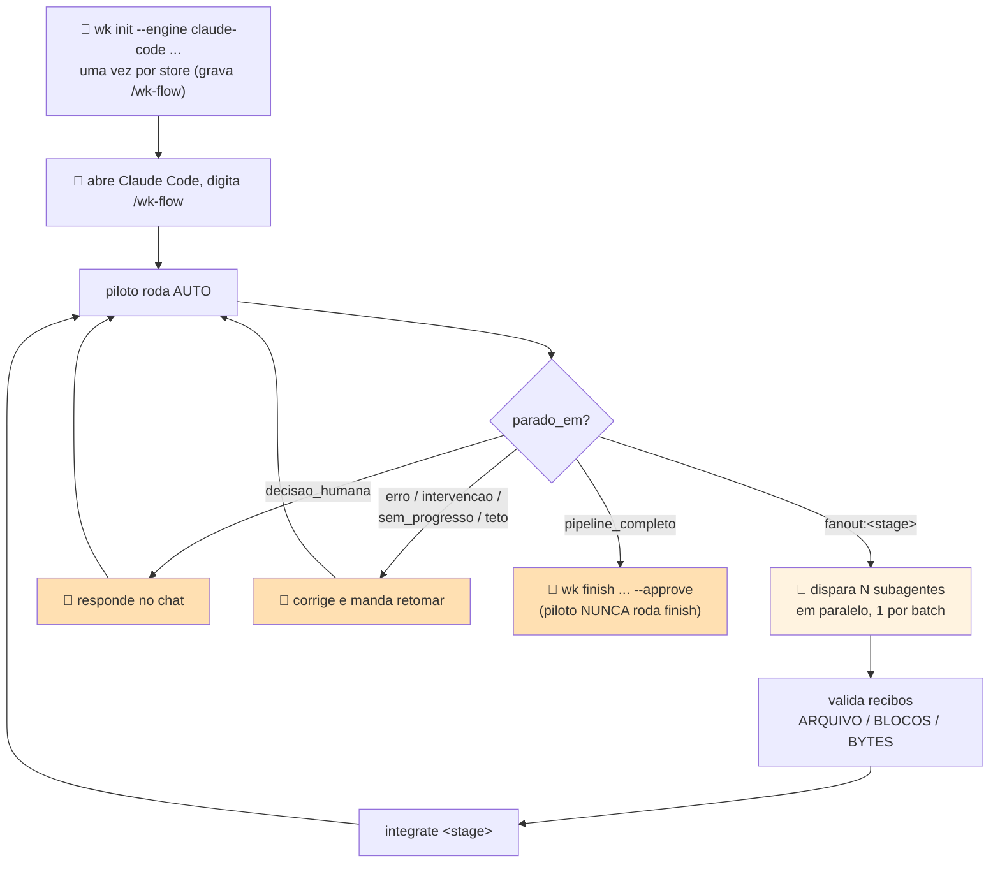

# Wiki AI — Guia de operação

Guia de operação do começo (clonar o repositório) ao fim (entregar os `.docx` aos agentes). O caminho é a **sequência-mestra de 7 passos** (§1). Cada passo é uma tabela `P# | Quem | O que fazer | O que acontece | Deu certo quando`: execute a linha, confira o sinal, passe para a próxima.

O fluxo legado (§12–§13) continua funcionando e está marcado como tal. Contrato JSON, erros e catálogo de comandos ficam nas seções 9, 14 e 15 — fora do caminho.

---

## 0. Antes de começar

### 0.1 Shell dos exemplos

**Todos os exemplos deste guia são para Git Bash no Windows** (`SHELL=C:\Program Files\Git\bin\bash.exe`, `MSYSTEM=MINGW64`). `wk doctor` reporta o shell detectado em `shell.detectado`.

| Regra do shell | Por quê | Como fazer |
|---|---|---|
| Use `export VAR=...`, nunca `VAR=...` sozinho | variável sem `export` fica só no shell e **não entra no ambiente do processo Python** — `WK_STORE` sem `export` é ignorado por `wk` | `export WK_STORE="C:/caminho/do/store"` |
| Escreva caminhos no estilo **Windows com barra normal** (`C:/Users/...`), não `/c/Users/...` | o Git Bash converte `/c/...` para o processo filho, mas o valor que aparece no JSON (e o que você vai colar depois) é o de Windows; misturar os dois gera dois `namespace` diferentes para o mesmo repo | `export WK_REPO="C:/Users/voce/projetos/meu-repo"` |
| Para `--namespace`, prefixe `MSYS2_ARG_CONV_EXCL='*'` | o MSYS converte argumentos que *parecem* caminho. `--namespace code/C:/Users/...` chega ao Python como `code\C;C:\Program Files\Git\Users\...` — **um namespace novo e errado**, silenciosamente | `MSYS2_ARG_CONV_EXCL='*' $WKPY "$WK" ingest ... --namespace "$WK_NS"` |

> Não use `MSYS_NO_PATHCONV=1` global: ele também desliga a conversão do caminho do `wk.pyz` e a invocação quebra com `can't open file 'c:\c\Users\...'`.

Em PowerShell, o mesmo comando não precisa de nenhuma dessas precauções (não há conversão de argumento); só troque `export VAR=` por `$env:VAR =` e `$WKPY` por `python`.

### 0.2 Legenda

| Símbolo | Quem | O que significa |
|---|---|---|
| 👤 | humano | executa o comando no terminal. Tudo que é determinístico é do humano |
| 🤖 | LLM | **no fluxo principal, o próprio `wk` despacha a engine** (`--engine local\|claude-cli`) — não existe prompt para colar. O modo colar-prompt existe **somente no fluxo legado** (§12) |

No fluxo principal (§2–§8) não há passo 🤖 nenhum: `wk analyze`/`wk ingest`/`wk update` fazem a análise estrutural determinística sozinhos e, se e só se a engine estiver disponível, despacham a leitura adicional por dentro. Engine indisponível **não trava** — a análise estrutural termina e o motivo sai em `bloqueios[]`.

### 0.3 Duas coisas diferentes chamadas `--engine`

| Comando | Valores aceitos | O que significa |
|---|---|---|
| `init` · `check` · `doctor` | `claude-code` · `antigravity` · `devin` · `copilot` · `all` (vírgula p/ vários) | qual assistente de código recebe skill/permissões/slash command em disco |
| `analyze` · `update` · `resume` | `local` · `claude-cli` | quem executa o despacho das tarefas de investigação (§3) |

### 0.4 Variáveis usadas em todos os comandos

```bash
export WKPY="python"
export WK="C:/Users/voce/projetos/wiki-ai/wk.pyz"
export WK_STORE="C:/caminho/do/store"
export WK_REPO="C:/caminho/do/repo"
export WK_TOPIC="codebases/nome-do-repo"
```

`--store` pode ser omitido em todo comando do fluxo principal quando `WK_STORE` está exportado (`_store_root`: `--store` > `WK_STORE` > `./store`). `wk store init` é a exceção: ele recebe o caminho como **posicional**, não lê `WK_STORE`.

---

## 1. Sequência-mestra

| # | Passo | Seção | Comando central | Encerra quando |
|---|---|---|---|---|
| 1 | Preparar ambiente e build | §2 | `python scripts/build_pyz.py` + `wk store init` + `wk doctor` | `doctor` com `bloqueios: []` |
| 2 | Escolher e preparar a engine | §3 | `--engine local` ou `--engine claude-cli` | você sabe qual das duas colunas da tabela §3.1 está comprando |
| 3 | Executar a análise e ler a completude | §4 | `wk analyze --repo ...` | os **três eixos** de §4.2 lidos separadamente |
| 4 | Continuar investigações parciais | §5 | `wk resume --repo ...` | `objetivos_por_estado.partial: 0`, ou teto de rodadas com decisão humana registrada |
| 5 | Ingerir inception/refinamento correlacionado | §6 | `wk ingest <fonte> --initiative ... --phase ... --namespace ...` | `fontes_incompletas: 0` (ou órfãos conhecidos e aceitos) |
| 6 | Atualizar o codebase e verificar invalidação | §7 | `wk update --repo ...` | `mudou: false`, ou `mudou: true` com `publicacoes.revisao` nova |
| 7 | Selecionar o Word do manifesto ativo e entregar | §8 | leitura de `publicacoes/manifest.json` | lista de `.docx` **únicos** + limitações declaradas |

Passos 3→4→6 são cíclicos: toda vez que o código muda, `update` reabre objetivos e `resume` fecha continuações.

---

## 2. PASSO 1 — Preparar ambiente e build

### 2.1 Pré-requisitos

| Item | Versão / condição | Como conferir | Se faltar |
|---|---|---|---|
| Python | **3.11+** | `python --version` | abaixo de 3.11 o `wk` ainda roda, mas a extração de `pyproject.toml` degrada com o aviso `runtime sem tomllib (Python < 3.11)` |
| git | qualquer versão recente | `git --version` | `--repo` sem git funciona (`repo.git: false` no `doctor`), mas o snapshot perde `head` e `wk code drift` fica sem commit pinado |
| `wk.pyz` | **construído localmente** | `ls wk.pyz` | não existe num clone novo — veja §2.2 |
| binário `claude` | opcional (só p/ `--engine claude-cli`) | `which claude` | §3 |

### 2.2 Obter o código e construir o `wk.pyz`

**`wk.pyz` NÃO está versionado** — está coberto por `*.py[codz]` no `.gitignore` e não aparece em `git ls-files`. Num clone novo o arquivo não existe; o build é obrigatório antes do primeiro comando.

| P# | Quem | O que fazer | O que acontece | Deu certo quando |
|---|---|---|---|---|
| P1 | 👤 | `git clone <url-do-wiki-ai> && cd wiki-ai` | traz `scripts/`, docs e templates; **não** traz `wk.pyz` | `ls scripts/build_pyz.py` existe e `ls wk.pyz` falha |
| P2 | 👤 | `python scripts/build_pyz.py` | reempacota `scripts/` (pacotes `wk`, `codescan`, `sbindex`, `knowledge`, `analysis`, `runtime`, `ingestion`, `publishing`) num `wk.pyz` executável | JSON com `artifact`, `source_sha256`, `bytes`, `documentos[]`, `pacotes[]`; `wk.pyz` no diretório |
| P3 | 👤 | `export WK="$(pwd)/wk.pyz"` — ou o caminho Windows (§0.1) | fixa o executável nos exemplos seguintes | `$WKPY "$WK" --version` responde |

Reconstrua o `.pyz` **sempre que `scripts/` mudar**. `wk doctor` acusa em `wk.pyz.pyz_desatualizado: true` (+ `acao`) comparando o `source_sha256` embutido com o `scripts/` ao lado — é **diagnóstico**, nunca vira `bloqueio` nem muda o exit code.

| Onde | Sinal | O que fazer |
|---|---|---|
| `wk.pyz.pyz_desatualizado: true` | hash da fonte embutida ≠ `scripts/` ao lado | 👤 `python scripts/build_pyz.py` |
| `wk.pyz.fonte_disponivel: false` | não há `scripts/` ao lado do `.pyz` (instalação só com o binário) | nada a fazer; é o estado normal de quem só tem o `.pyz` |

### 2.3 Criar o store, gravar permissões e diagnosticar

| P# | Quem | O que fazer | O que acontece | Deu certo quando |
|---|---|---|---|---|
| P4 | 👤 | `$WKPY "$WK" store init "$WK_STORE"` | cria `inbox/`, `raw/`, `wiki/`, `log.md`, `quarantine.md` | `criados[]` preenchido |
| P5 | 👤 | `$WKPY "$WK" init --engine claude-code --store "$WK_STORE" --repo "$WK_REPO"` | materializa a skill em disco, grava as permissões da engine **e** o slash command `/wk-flow` (`.claude/commands/wk-flow.md`) | `permissoes[]` preenchido e `comando_wk_flow: {"status": "criado", "caminho": ...}` |
| P6 | 👤 | `$WKPY "$WK" doctor --store "$WK_STORE" --repo "$WK_REPO" --engine claude-code` | diagnostica shell, python, `wk` (+ frescor do `.pyz`), store, repo, engine | **`bloqueios: []`** (exit 0; com bloqueios o exit é 1) |

`knowledge.db`, `runtime.db`, `publicacoes/` e `.analysis/` **não** são criados por `store init` — nascem na primeira `wk analyze`/`wk ingest` (§9.9).

---

## 3. PASSO 2 — Escolher e preparar a engine

`--engine` de `analyze`/`update`/`resume` decide **se existe investigação comportamental**, não só velocidade. As duas opções produzem análise estrutural; só uma delas investiga.

### 3.1 `local` × `claude-cli`

| | `--engine local` | `--engine claude-cli` |
|---|---|---|
| O que é | worker Python determinístico embutido (`LocalThreadExecutor`), **sem LLM** | binário `claude` no PATH, sondado com `claude --version` no `__init__` do executor |
| Pré-requisito | nenhum | binário `claude` acessível no PATH |
| Análise estrutural (entidades, relações, fatos com evidência de código) | **completa** | **completa** |
| Investigação comportamental (ler código novo p/ fechar `reading_needs`) | **não faz** — fecha a tarefa confirmando só o que a extração estática já estabeleceu | faz |
| `capabilities()["deepening"]` | `False` | `True` (quando o binário foi detectado; `False` quando não) |
| Continuações (§5) | **RECUSADAS**, sem criar tarefa e **sem consumir rodada** | criadas e executadas, 1 rodada por invocação |
| Objetivo pode chegar a `complete` | **não** — `reading_needs` abertas permanecem abertas | sim |
| Custo/tempo | rápido, offline | depende da engine externa |
| Quando usar | fumaça, CI, validar o pipeline, publicar o esqueleto estrutural | investigação de verdade — o único caminho para `status_geral: completo` |

O worker local grava esta nota no resultado, literalmente: *"engine local: nenhuma leitura adicional de LLM realizada nesta execução; resultado limitado ao que a extração estática já estabeleceu"*.

### 3.2 Quando o binário `claude` não está disponível

Não trava. `wk analyze --engine claude-cli` sem o binário:

| Onde | O que sai |
|---|---|
| **stderr** | `ClaudeCliExecutor sem despacho disponível: binário não encontrado no PATH: 'claude'. Configure o binário e reinicie ...` — o JSON continua limpo no **stdout** (redirecione os dois separadamente: `> out.json 2> err.txt`) |
| `bloqueios[]` (stdout) | **uma** entrada `{"tipo": "dispatch_indisponivel", "engine": "claude-cli", "motivo": ..., "impacto": "análise estrutural determinística concluída ...; nenhuma leitura adicional via engine foi feita"}` |
| `revisao.revision_id` | preenchido — a revisão estrutural **foi gravada** |
| `proximo_passo` | `configure o binário/credenciais da engine e rode 'wk resume --repo <repo>' ...; a análise estrutural já concluída não precisa ser refeita` |
| exit code | **0** |

O bloqueio é registrado **uma vez** por execução no JSON — nunca vira laço de retentativa. (O aviso em stderr pode aparecer 2×: a engine é sondada uma vez antes de planejar continuações e outra antes de despachar.)

| `bloqueios[].tipo` | Quando acontece | O que já ficou pronto | O que o humano faz |
|---|---|---|---|
| `dispatch_indisponivel` | engine escolhida não despacha agora | análise estrutural COMPLETA, revisão gravada | configure o binário/credenciais e rode `wk resume --repo ...`. **Não** refaça a análise |
| `engine_desconhecida` | engine não registrada | idem | corrija o `--engine` e rode `wk resume` |
| `snapshot_ausente` (`resume`) | manifesto do snapshot não encontrado em `.analysis/snapshots/` | nada foi integrado nesta retomada | rode `wk analyze --repo ...` para recriar o manifesto |
| `extracao_indisponivel` (`resume`) | o pipeline de extração falhou na retomada | resultados não puderam ser confrontados com o código | leia `detalhe` (tipo + mensagem) e corrija o repo |

---

## 4. PASSO 3 — Executar a análise e ler a completude

Um comando faz o pipeline inteiro: snapshot → inventário → extração → capacidades → objetivos → tarefas (`runtime.db`) → despacho → **revisão estrutural** em `knowledge.db` → **integração** dos resultados (nova revisão) → uma rodada de continuação → publicação real em `store/publicacoes/`.

| P# | Quem | O que fazer | O que acontece | Deu certo quando |
|---|---|---|---|---|
| P1 | 👤 | `$WKPY "$WK" analyze --repo "$WK_REPO" --topic "$WK_TOPIC" --engine claude-cli` | roda o pipeline inteiro e publica `markdown/` + `word/` + `manifest.json` | exit **0**; `revisao.revision_id` preenchido; `publicacoes.bloqueios` ausente |
| P2 | 👤 | ler os **três eixos** da saída (§4.2) — não pare no exit code | separa "o comando rodou" de "a investigação fechou" de "a publicação saiu" | você consegue dizer, em uma frase, o estado de cada eixo |
| P3 | 👤 | `$WKPY "$WK" status --repo "$WK_REPO"` | lê `runtime.db` + `knowledge.db` + `.analysis/last_integration.json` | `objetivos_por_estado` e `objetivos_pendentes[]` batem com o que P2 disse |
| P4 | 👤 | se houver `partial`/`blocked` ou `bloqueios[]` → §5 | continuação/retomada | — |

`--topic` e `--engine` são gravados no perfil (`store/.analysis/profile.json`) e reaproveitados nas execuções seguintes — não precisa repetir.

### 4.1 O `status_geral` e o exit code

Três estados, e o exit code deriva só deles:

| `status_geral` | Quando | exit |
|---|---|---|
| `bloqueado` | erro material, ou publicação bloqueada **sem** revisão nova (nada de útil saiu) | **2** |
| `parcial` | objetivo `partial`/`blocked`, decisão pendente, fonte incompleta, bloqueio de execução, ou publicação bloqueada **com** revisão gravada | **0** |
| `completo` | nada ficou pendente | **0** |

`parcial` sai com **0 de propósito**: houve resultado útil e o que falta está explícito no JSON. E `completo` só quando NADA ficou em aberto — para que o silêncio do exit 0 não seja confundido com análise concluída.

### 4.2 Três eixos de sucesso — leia os três, separadamente

> **Exit 0 + `bloqueios: []` NÃO significa investigação concluída.** Significa apenas que o comando rodou sem erro material.

| Eixo | Onde ler | "Fechado" quando | "Aberto" quando |
|---|---|---|---|
| **1. Execução** | exit code · `bloqueios[]` · `resultados{}` | exit **0** e `bloqueios: []` | exit **2** (`status_geral: bloqueado`), ou `bloqueios[]` com `dispatch_indisponivel`/`engine_desconhecida`/`snapshot_ausente` |
| **2. Investigação** | `status_geral` · `integracao.objetivos_por_estado` · `integracao.lacunas_totais` · `lacunas[]` | `status_geral: completo` **e** `objetivos_por_estado.partial == 0` **e** `.blocked == 0` | qualquer `partial`/`blocked`, ou `lacunas[]` não vazio — mesmo com exit 0 |
| **3. Publicação** | `publicacoes.bloqueios` · `publicacoes.revisao` · `publicacoes.documentos` · `manifest.json` | chave `bloqueios` **ausente** em `publicacoes` e `revision_id` do `manifest.json` == `publicacoes.revisao` | `publicacoes.bloqueios[]` presente (ex.: `"plano não produziu nenhum documento publicável"`) |

**Tabela de interpretação (combinações reais):**

| exit | `bloqueios[]` | `status_geral` | `objetivos_por_estado` | `publicacoes.bloqueios` | Leitura correta | Próxima ação |
|---|---|---|---|---|---|---|
| 0 | `[]` | `completo` | `partial: 0, blocked: 0` | ausente | tudo fechado nos três eixos | §7 (`update`) quando o código mudar |
| 0 | `[]` | `parcial` | `partial: 1+` | ausente | **execução ok, publicação ok, investigação NÃO concluída** — o caso normal de `--engine local` | §5: trocar para `claude-cli` e continuar |
| 0 | `[dispatch_indisponivel]` | `parcial` | zerado | `["plano não produziu nenhum documento publicável"]` | revisão estrutural gravada; nenhuma leitura feita; sem documento a publicar ainda | configurar o binário e `wk resume` |
| 0 | `[]` | `parcial` | `partial: 0` | `[...]` | conhecimento gravado, publicação falhou; **a publicação anterior segue ativa** | ler `publicacoes.bloqueios[]` e reexecutar |
| 2 | — | `bloqueado` | — | `[...]` | publicação bloqueada **sem** revisão nova: nada de útil saiu | corrigir a causa e reexecutar |

**Exemplo real (`--engine local`, exit 0):**

```json
{
  "status_geral": "parcial",
  "revisao":     { "revision_id": "rev_b159a514...", "mudancas": 1 },
  "integracao":  { "revisao": "rev_accd8e02...", "objetivos_por_estado": { "complete": 0, "partial": 1, "blocked": 0 },
                   "lacunas_totais": 2, "reread_obligations": 1, "bloqueios": [] },
  "continuacao": { "round": 0, "max_rounds": 3, "criadas": [], "recusadas": [ {"motivo": "...deepening=False..."} ],
                   "motivo": "engine 'local' não aprofunda leitura ..." },
  "publicacoes": { "revisao": "rev_accd8e02...", "documentos": 1, "namespaces_publicados": ["code/C:/.../repo"] },
  "bloqueios": []
}
```

`bloqueios: []` e exit 0 — e mesmo assim **1 objetivo `partial`, 2 lacunas e 1 obrigação de releitura em aberto**. É esta linha que decide o que fazer, não o exit code.

---

## 5. PASSO 4 — Continuar investigações parciais (retomada)

Um objetivo `partial` com obrigações de leitura abertas gera uma **continuação**: uma tarefa nova em `runtime.db` que carrega exatamente quais leituras faltam. `analyze`/`update`/`resume` rodam **uma rodada por invocação** — o laço avança por invocação, nunca dentro de um `while` interno.

| P# | Quem | O que fazer | O que acontece | Deu certo quando |
|---|---|---|---|---|
| P1 | 👤 | ler `proximo_passo` da saída anterior | é o guia: traz o comando exato para o estado em que a execução parou | você sabe qual das 3 linhas de §5.2 é a sua |
| P2 | 👤 | `$WKPY "$WK" resume --repo "$WK_REPO" --engine claude-cli` | libera leases expirados, **executa** as `ready`, **reintegra** em `knowledge.db`, planeja+roda 1 rodada de continuação e **republica** | `continuacao.criadas[]` preenchido, `continuacao.round` ≥ 1, `publicacoes.revisao` nova |
| P3 | 👤 | `$WKPY "$WK" status --repo "$WK_REPO"` | mostra `continuacao.max_rounds`, `continuacao.round_maximo`, `continuacao.por_objetivo{}` e `leituras{satisfeitas, nao_satisfeitas}` | `objetivos_pendentes[]` encolhendo a cada rodada |
| P4 | 👤 | repetir P2 enquanto houver `partial` e `round_maximo < max_rounds` | cada invocação avança 1 rodada | `objetivos_por_estado.partial: 0` — ou teto atingido (§5.3) |

### 5.1 Tarefa `done` ≠ investigação completa

`wk status` mostra os dois planos, e eles divergem de propósito:

| Chave | Fala de | Exemplo real |
|---|---|---|
| `tarefas_por_estado` | `runtime.db`: a tarefa **executou** | `{"done": 1}` |
| `objetivos_por_estado` | `.analysis/last_integration.json`: o objetivo **fechou** | `{"complete": 0, "partial": 1, "blocked": 0}` |

Uma tarefa `done` cujo objetivo ficou `partial` é o caso normal do worker local: ele executou e devolveu, mas nenhuma obrigação de leitura foi fechada. Nunca leia `tarefas_por_estado` como progresso de investigação.

### 5.2 Como o `wk` recusa uma continuação — e o que fazer

`continuacao` é um objeto fixo: `{round, round_historico, max_rounds, criadas[], recusadas[], executadas{}, motivo}`.

| Situação | Sinal no JSON | Consumiu rodada? | Ação |
|---|---|---|---|
| **Engine sem `deepening`** (`local`) | `criadas: []` · `recusadas[*].motivo` contém `deepening=False` · `motivo` de topo: `engine 'local' não aprofunda leitura (capabilities()['deepening'] é False); nenhuma continuação foi criada — use --engine claude-cli para leitura adicional real` | **NÃO** — a recusa acontece antes de qualquer leitura de rodada; `round_historico` fica em `0` | rode de novo com `--engine claude-cli` (com o binário configurado). `wk resume` na mesma engine recusaria igual, sem progresso |
| **Engine indisponível, tarefas criadas** | `criadas[]` preenchido · `bloqueios[]` com `dispatch_indisponivel` | sim (a tarefa nasceu) | as tarefas ficam `ready` em `runtime.db` **com as leituras que faltam gravadas**; configure a engine e rode `wk resume` |
| **Teto de rodadas atingido** | `recusadas[]` preenchido, sem `motivo` de topo · `max_rounds: 3` | não cria mais | `proximo_passo`: *"N objetivo(s) `partial` não geraram continuação (ver `continuacao.recusadas`: teto de 3 rodadas ou nenhuma leitura com alvo concreto); o fechamento depende de decisão humana"* |
| **Continuação executada** | `criadas[]` preenchido · `executadas{}` com contadores | sim | `proximo_passo` manda rodar `wk resume` para a próxima rodada |

### 5.3 Teto de rodadas

`runtime.tasks.DEFAULT_MAX_CONTINUATION_ROUNDS = 3`, exposto em `continuacao.max_rounds` e em `wk status → continuacao.max_rounds`. É **política do store**, gravada em `runtime.db`; **não existe flag de CLI** para mudá-la (só a API `runtime.tasks.set_max_continuation_rounds`).

Duas leituras de rodada, deliberadamente diferentes:

| Chave | Significa |
|---|---|
| `continuacao.round` | a rodada **criada agora**. Depois de um `wk update`, as entradas mudaram, a tarefa-mãe é nova e a cadeia recomeça em 1 |
| `continuacao.round_historico` | a maior rodada já existente para o objetivo — é a que `wk status` mostra por objetivo em `continuacao.por_objetivo{}` |

Atingido o teto, o fechamento é **decisão humana**: aceite o `partial` com as lacunas declaradas (§8.4) ou reduza o escopo do objetivo.

---

## 6. PASSO 5 — Ingerir inception/refinamento correlacionado ao codebase

`wk ingest` preserva a fonte, extrai candidatos, correlaciona no `knowledge.db` e republica a revisão. Correlacionar com o **codebase** exige mandar a ingestão para o **namespace da análise** — senão a referência técnica não encontra nada.

### 6.1 Descobrir o namespace da análise

O namespace de uma análise é `code/<caminho absoluto do repo, com barra normal>` — **não** `code/<nome-do-repo>`. Nunca o digite de memória; leia de uma destas duas fontes:

| Comando | Chave | Exemplo de valor |
|---|---|---|
| `wk status --repo "$WK_REPO"` | `escopo_efetivo.namespace` | `code/C:/Users/voce/projetos/meu-repo` |
| `wk analyze` / `wk update` / `wk resume` | `escopo_efetivo.namespace`, e `publicacoes.namespaces_publicados[]` (todos os universos que entraram no manifesto) | idem |

```bash
export WK_NS="$($WKPY "$WK" status --repo "$WK_REPO" | python -c "import json,sys; print(json.load(sys.stdin)['escopo_efetivo']['namespace'])")"
echo "$WK_NS"
```

> `wk status` **não** tem a chave `namespaces_publicados` — ela é da saída de `analyze`/`update`/`resume`/`ingest`, dentro de `publicacoes`. Em `status` o namespace da análise está em `escopo_efetivo.namespace`.

### 6.2 Exemplo copiável — com e sem `--namespace`

Fonte de refinamento que cita uma entidade técnica (`RN-023`):

```markdown
---
initiative_id: INI-42
phase: refinement
---

# RF-042 — Estorno parcial de cobranca

Decisao: o estorno parcial passa a ser permitido para transacoes liquidadas.

RF-042 propoe alteracao em RN-023 (limite de valor por cobranca), hoje implementada no servico de pagamento.

Requisito: o estorno parcial nao pode ultrapassar o valor original da cobranca.
```

**(a) ERRADO — sem `--namespace`** (cai no default `wiki`, onde não existe entidade de código nenhuma):

```bash
$WKPY "$WK" ingest "C:/fontes/refinamento-cobranca.md" --initiative INI-42 --phase refinement
```

```json
{
  "status_geral": "parcial",
  "fontes": [{
    "path": "C:/fontes/refinamento-cobranca.md", "status": "ingested",
    "candidatos": 4, "correlacionadas": 4, "orfaos": 2,
    "referencias_orfas": [{ "id": "RN-023", "blocos": ["blk-00002-2e1a7ad2bbd9"] }],
    "completa": false,
    "motivo_incompleta": "referência(s) explícita(s) não resolvida(s) por stable_key nem alias: RN-023 ...",
    "decisoes_pendentes": [{ "key": "referencia_orfa", "question": "A qual entidade cada referência explícita abaixo corresponde? ...", "options": ["RN-023"], "material_effect": "1 referência(s) explícita(s) sem entidade correspondente: vínculo(s) que dependeriam dela(s) ficam de fora até a decisão" }]
  }],
  "fontes_incompletas": 1,
  "avisos": ["1 fonte(s) com decisão pendente ...", "1 fonte(s) correlacionada(s) de forma INCOMPLETA ... o status_geral desta execução é no mínimo `parcial`"],
  "publicacoes": { "namespace_origem": "wiki", "namespaces_publicados": ["code/C:/.../repo", "wiki"] }
}
```

Exit **0**. Isto é **comportamento correto, não bug**: a aresta `proposes_change_to` que dependeria de `RN-023` não nasce, a fonte é aceita, o lote não trava — e o resultado é honestamente `parcial`.

**(b) CERTO — com o namespace da análise** (note o `MSYS2_ARG_CONV_EXCL`, §0.1):

```bash
MSYS2_ARG_CONV_EXCL='*' $WKPY "$WK" ingest "C:/fontes/refinamento-cobranca.md" \
  --initiative INI-42 --phase refinement --namespace "$WK_NS"
```

Com a `BusinessRule` `RN-023` já existente **naquele namespace**, a referência resolve (por `stable_key` literal ou pelo **alias** `RN-023` que a integração registra quando o nome/enunciado da regra traz o id explícito), a aresta nasce, `referencias_orfas` some e `fontes_incompletas` fica em `0`.

### 6.3 Pré-condição que o `--namespace` sozinho não resolve

Apontar o namespace certo é **necessário, não suficiente**: a entidade técnica precisa **existir lá**.

| Tipo citado | Prefixos | Criado a partir de documento? |
|---|---|---|
| Iniciativa · Decisão · Requisito · História · Refinamento | `INI` `DEC`/`ADR` `RQ`/`REQ`/`RNF` `US`/`HU`/`STY` `RF`/`REF` | **sim** (`CREATABLE_TYPES`) — o texto pode criar |
| Regra de negócio · Capacidade · Componente · Sistema · Contrato · Entidade de dados · Fluxo | `RN`/`BR` `CAP` `CMP` `SYS` `CTR` `ENT` `FLW` | **não** — existência e comportamento de entidade técnica são atestados pelo pipeline de análise de código, nunca por um texto que os cita. Citação a uma técnica inexistente vira `referencias_orfas` |

Logo: `RN-023` só resolve se **alguma `wk analyze` já nomeou aquela regra naquele repo**. Com `--engine local` isso nunca acontece (o worker local não produz regra nomeada); o caminho que cria a `BusinessRule` com o alias `RN-023` é a investigação por `--engine claude-cli` (§3).

### 6.4 Reingestão: `duplicada` mascara o órfão

Reingerir **o mesmo conteúdo no mesmo namespace** faz curto-circuito por `svid`: nenhuma correlação roda de novo.

```json
{ "status_geral": "completo",
  "fontes": [{ "status": "ingested", "candidatos": 4, "correlacionadas": 0, "duplicada": true }],
  "fontes_incompletas": 0, "revisoes": [], "avisos": [] }
```

> `status_geral: completo` numa reingestão duplicada significa **"nada a fazer nesta execução"**, não "os órfãos foram resolvidos". A leitura autoritativa dos órfãos é a saída da execução que de fato correlacionou (ou uma reingestão após mudar o conteúdo).

### 6.5 Contrato por fonte (`fontes[]`)

| Chave | Quando aparece | Significa |
|---|---|---|
| `status` | sempre | status honesto do adapter (`ingested`, `partial`, …) — é ele que decide o exit code do lote, não o resultado da correlação |
| `candidatos` | sempre | quantos candidatos a fato foram extraídos |
| `correlacionadas` | sempre | fatos + arestas efetivamente gravados no `knowledge.db` |
| `orfaos` | quando > 0 | candidatos (prosa) que não encontraram unidade correspondente |
| `referencias_orfas[]` | quando > 0 | **id explícito de padrão conhecido** (`RN-023`) que não resolveu por `stable_key` nem por alias. Cada item: `{id, blocos[]}` |
| `completa` / `motivo_incompleta` | quando `completa: false` | há `referencias_orfas`; a fonte é aceita, mas a execução nunca sai `completo` |
| `duplicada` | quando `true` | mesmo conteúdo já ingerido (mesmo `svid`) — §6.4 |
| `decisoes_pendentes[]` | quando há ambiguidade ou órfão | `key` (`referencia_orfa`, iniciativa ambígua…) · `question` · `options[]` · `material_effect`. **Aceita sem bloqueio** |
| `diagnostico` | quando a fonte falhou | `causa` · `impacto` · `correcao_tentada` · `decisao_necessaria`. Falha isolada **não** derruba o lote |
| `indisponivel` | quando o adapter não conseguiu ler | o motivo declarado pelo adapter |

### 6.6 Formatos com adapter nativo

`.md` · `.markdown` · `.mdown` · `.txt` · `.text` · `.docx` · `.docm` · `.pdf` · `.html` · `.htm` · `.xhtml` · `.json` · `.jsonl` · `.xml` · `.xmi` · `.xsd` · `.wsdl` · `.rels` · `.srt` · `.vtt` — mais **diretório** (recursivo). Formato sem adapter é preservado com proveniência (entidade + hash) e sai com `diagnostico` explicando que não houve extração de conteúdo.

### 6.7 Iniciativa e fase

Precedência de `--initiative`/`--phase`: **argumento > frontmatter/metadata do arquivo > contexto persistido por diretório**. `--phase` aceita `inception` · `refinement` · `other`. Só a referência EXPLÍCITA (argumento ou frontmatter) é persistida — para não perguntar de novo no mesmo diretório.

Exit code do lote: **0** se ao menos uma fonte saiu `ingested`/`partial`; **2** (`status_geral: bloqueado`) se nenhuma.

---

## 7. PASSO 6 — Atualizar o codebase, invalidar e republicar

| P# | Quem | O que fazer | O que acontece | Deu certo quando |
|---|---|---|---|---|
| P1 | 👤 | `$WKPY "$WK" update --repo "$WK_REPO"` | compara o snapshot atual com o da última `analyze`/`update`; **só o delta** é reanalisado | sem mudança: **exatamente 3 chaves** — `{"mudou": false, "mensagem": "sem mudanças desde a última análise; nada foi reexecutado", "snapshot_id": ...}` e **nada** foi republicado |
| P2 | 👤 | quando `mudou: true`, ler `delta` e as três listas de invalidação | ver tabela abaixo | `publicacoes.revisao` **nova** e `manifest.json` com esse `revision_id` |
| P3 | 👤 | os objetivos invalidados voltam a `partial` → §5 | a investigação recomeça a cadeia de rodadas em 1 | `objetivos_por_estado` fechando de novo |

**Chaves de `mudou: true`:**

| Chave | Conteúdo | Exemplo real |
|---|---|---|
| `delta` | `{adicionados[], removidos[], alterados[]}` | `{"adicionados": [], "removidos": [], "alterados": ["src/pagamento.py"]}` |
| `objetivos_invalidados[]` | objetivos cujas entradas mudaram — serão reexecutados | `["obj_5af2bdec..."]` |
| `objetivos_obsoletos[]` | objetivos que sumiram do replanejamento | `[]` |
| `conhecimento_invalidado[]` | o que caiu em `knowledge.db`, por arquivo | `[{"path": "src/pagamento.py", "entidades": 0, "fatos": 1, "relacoes": 0}]` |

Depois vêm as mesmas chaves de `analyze` (`status_geral`, `capacidades_analisadas`, `revisao`, `integracao`, `continuacao`, `publicacoes`, `resultados`, `lacunas`, `bloqueios`, `escopo_efetivo`, `proximo_passo`).

> `update` **sem mudança não emite `status_geral`** nem republica. `update` sem `analyze` anterior para o mesmo `--repo` sai com exit **2** e `acao` trazendo o `wk analyze` pronto.

**Cuidado com o `--repo`:** o perfil é indexado pelo caminho absoluto normalizado. `--repo C:/x/repo` e `--repo /c/x/repo` (§0.1) são **duas análises diferentes**, com dois namespaces e dois perfis.

---

## 8. PASSO 7 — Selecionar o Word do manifesto ativo e entregar

### 8.1 Unidades são AGRUPADAS em documentos

Cada `document` do plano vira **exatamente um** `.md` e **um** `.docx`, com **várias unidades dentro**. O `manifest.json`, porém, é indexado por `unit_id`: várias unidades apontam para o **mesmo** par `md_path`/`docx_path`.

> **Nunca prometa "1 `.docx` por unidade".** Medição real de um store: **10 entradas de unidade → 4 `.docx` únicos → 4 arquivos em disco** (3 unidades por documento na maioria).

### 8.2 A seleção correta: caminhos ÚNICOS do manifesto ativo

O manifesto ativo (`store/publicacoes/manifest.json`) é a **única** fonte da lista a subir. Não liste o diretório `word/` (ele pode conter arquivos de revisões anteriores até a poda) e não derive nomes.

```bash
cat > selecionar-word.py <<'PY'
import json, os
root = os.path.join(os.environ["WK_STORE"], "publicacoes")
m = json.load(open(os.path.join(root, "manifest.json"), encoding="utf-8"))
docs = m["documents"]                                   # {unit_id: {md_path, docx_path, ...}}
paths = sorted({d["docx_path"].replace("\\", "/") for d in docs.values()})   # DEDUPE
print("revision_id:", m["revision_id"])
print("unidades no manifesto:", len(docs), "| .docx unicos:", len(paths))
for p in paths:
    print(os.path.join(root, p.replace("/", os.sep)))
PY
$WKPY selecionar-word.py
```

Saída real:

```
revision_id: rev_c21fc58d9db443a2bb5d40aac7a4a85f
unidades no manifesto: 10 | .docx unicos: 4
```

Os caminhos no manifesto usam separador `\` (Windows) — normalize antes de deduplicar, senão a contagem sai errada.

### 8.3 Revisão publicada ≠ revisão estrutural

Uma execução grava **duas ou mais** revisões: a estrutural, depois a de integração, depois (se houver) a de continuação. **O que é publicado é a ÚLTIMA.**

| Chave | O que é | Exemplo real da MESMA execução |
|---|---|---|
| `revisao.revision_id` | revisão **estrutural** (entidades/relações do snapshot) | `rev_b159a5145b0a48d6a0bf066a6e908d16` |
| `integracao.revisao` | revisão da **integração** dos resultados de investigação | `rev_accd8e02a7544cd9ad9d680a7745b31e` |
| `publicacoes.revisao` | a revisão efetivamente publicada — **a de integração**, quando existe | `rev_accd8e02a7544cd9ad9d680a7745b31e` |
| `manifest.json → revision_id` | **o critério de verdade do que está no disco** | `rev_accd8e02a7544cd9ad9d680a7745b31e` |

> **Critério de "publicação certa": `manifest.json → revision_id` == `publicacoes.revisao`.** Nunca exija igualdade com `revisao.revision_id` — a publicada é normalmente **posterior** à estrutural, e essa diferença é o comportamento correto (publicar a estrutural sairia com o estado anterior aos fatos que a integração acabou de gravar).

O manifesto também traz `previous_revision` (a revisão anterior), e cada entrada carrega `content_hash`, `fact_ids[]` e `state` (`published`).

### 8.4 Antes de entregar aos agentes — declare as limitações

| Pasta / arquivo | Para quê |
|---|---|
| `store/publicacoes/word/` | **upload manual** no SharePoint — só os caminhos únicos de §8.2 |
| `store/publicacoes/markdown/` | mesma revisão em Markdown, para leitura/diff |
| `store/publicacoes/manifest.json` | índice `unit_id → {md_path, docx_path, content_hash, fact_ids[], state}` + `revision_id` e `previous_revision` |
| `store/publicacoes/.history/<revision_id>/` | snapshot completo de cada revisão anterior — material de rollback |

Não existe comando `wk` que fale com SharePoint ou Copilot Studio: o upload é 👤, manual.

**Checklist de honestidade — responda com o JSON na mão antes de liberar o conteúdo:**

| Pergunta | Onde está a resposta | O que declarar se estiver aberto |
|---|---|---|
| A investigação fechou? | `status_geral` · `integracao.objetivos_por_estado` | "N capacidades saíram `partial`: o conteúdo cobre a estrutura, não o comportamento" |
| Que lacunas ficaram? | `lacunas[]` (por objetivo, com `pendencias[]`) · `integracao.lacunas_totais` | liste as `pendencias[]` — elas dizem exatamente qual campo/símbolo não foi coberto |
| Alguma leitura ficou pendente? | `integracao.leituras.nao_satisfeitas` · `integracao.reread_obligations` | "há obrigação de releitura em aberto" |
| Alguma referência ficou órfã? | `fontes[].referencias_orfas` · `fontes_incompletas` | "a relação com `RN-023` não foi gravada" |
| Algum resultado foi descartado/rejeitado? | `integracao.descartados{total,motivos[]}` · `integracao.rejeitados{total,itens[]}` | diga quantos e por quê (escopo/versão/caminho fora do snapshot) |
| Que engine produziu isto? | `escopo_efetivo.engine` | com `local`: "análise estrutural apenas, sem investigação comportamental" |
| A publicação é da revisão corrente? | `manifest.json → revision_id` vs `publicacoes.revisao` | se divergirem, o disco está atrás — republique |

---

## 9. Contrato JSON do fluxo principal

Chaves reais, conferidas na saída dos comandos.

### 9.1 `status_geral` (todos os comandos compostos)

Ver §4.1. Presente em `analyze`, `update` (só quando `mudou: true`), `resume` e `ingest`.

### 9.2 `integracao` — o que virou conhecimento

| Chave | Tipo | Interpretação | Ação de recuperação |
|---|---|---|---|
| `revisao` | id ou `null` | revisão gravada por esta integração. `null` = nada a integrar | `null` + `bloqueios` com *"nenhum resultado aceito em runtime.db..."* → a engine não despachou; §3.2 |
| `mudancas` | int | mudanças da revisão de integração | `0` numa reexecução sobre árvore inalterada é normal (revisão idempotente) |
| `objetivos_por_estado` | `{complete, partial, blocked}` | **o eixo 2 de §4.2** | qualquer `partial`/`blocked` > 0 → §5 |
| `fatos` | `{supported, disputed, unresolved}` | veredito epistêmico dos fatos | `unresolved` alto com `--engine local` é esperado; com `claude-cli` indica evidência insuficiente |
| `fatos_gravados` | int | fatos escritos no `knowledge.db` | `0` com objetivos `done` → resultado descartado; ver `descartados` |
| `lacunas_totais` | int | soma das lacunas de todos os objetivos | > 0 → declarar em §8.4 |
| `reread_obligations` | int | obrigações de releitura ainda abertas | > 0 → §5 (continuação) |
| `descartados` | `{total, motivos[{objective_id, task_id, motivo}]}` | resultados **aceitos pelo coordenador** que a integração recusou por escopo (outro repo no mesmo `runtime.db`) ou por versão de entrada vencida | rode `wk analyze` do repo certo, ou reexecute para gerar resultado sobre a versão atual |
| `rejeitados` | `{total, itens[]}` | afirmações que não viraram fato (caminho fora do snapshot, sujeito de outro namespace) | conferir `--repo`/`--namespace` |
| `leituras` | `{satisfeitas, nao_satisfeitas, itens_satisfeitos[], itens_nao_satisfeitos[]}` | leituras exigidas vs. cumpridas (amostra nos `itens_*`) | `nao_satisfeitas` > 0 → §5 |
| `bloqueios` | `[]` de string | falha da integração — **nunca** derruba o comando nem desfaz a revisão estrutural | ler a mensagem; a publicação segue com a revisão que existir |

### 9.3 `continuacao` — a rodada de aprofundamento

| Chave | Interpretação | Ação |
|---|---|---|
| `round` | rodada **criada agora** (`0` = nenhuma) | — |
| `round_historico` | maior rodada já existente p/ o objetivo | comparar com `max_rounds` |
| `max_rounds` | teto (3, política do store) | §5.3 |
| `criadas[]` | `task_id` das continuações criadas | vazio + `motivo` → §5.2 linha 1 |
| `recusadas[]` | `{objective_id, motivo}` por objetivo recusado | ler o `motivo`: `deepening=False` vs. teto |
| `executadas{}` | contadores do despacho desta rodada (`submitted`, `accepted`, …) | `submitted: 0` com `criadas[]` cheio → engine indisponível |
| `motivo` | resumo único quando **toda** recusa veio de `deepening=False` | trocar de engine (§3) |
| `bloqueios` | presente só quando o despacho da continuação falhou | §3.2 |

### 9.4 `ingest` — órfãos e completude

| Chave | Onde | Interpretação | Ação |
|---|---|---|---|
| `fontes_incompletas` | topo | quantos `CorrelationResult` saíram `completa: false` | > 0 → §6.2/§6.3 |
| `fontes[].referencias_orfas[]` | por fonte | `{id, blocos[]}` — id explícito que não resolveu | reingerir com `--namespace` correto, ou analisar o repo até a entidade técnica existir |
| `fontes[].motivo_incompleta` | por fonte | frase pronta com os ids | copiar para a declaração de limitações |
| `revisoes[]` | topo | ids gravados por este lote (vazio numa reingestão duplicada) | §6.4 |
| `unidades_afetadas[]` | topo | `entity_id` das unidades tocadas | — |

### 9.5 `publicacoes` — o eixo 3

| Chave | Interpretação |
|---|---|
| `revisao` | revisão publicada (§8.3) |
| `namespace_origem` | namespace **desta execução** (o que foi gravado agora) |
| `namespaces_publicados[]` | **todos** os universos que entraram no manifesto — o manifesto é único por store e cobre a UNIÃO. É por isso que `wk ingest` (namespace `wiki`) não apaga do manifesto os documentos de código de `wk analyze` (`code/<repo>`) |
| `markdown` · `word` · `manifesto` | caminhos **relativos ao store** |
| `documentos` | quantos documentos o plano produziu (≠ número de unidades, §8.1) |
| `bloqueios[]` | presente só quando a publicação falhou. Ex.: `"plano não produziu nenhum documento publicável"`. **Nunca desfaz conhecimento**: a revisão já está em `knowledge.db` e a publicação anterior segue ativa/servível |

`publicacoes` é **ausente** em `wk ingest` quando nenhuma revisão nova foi gravada.

### 9.6 `escopo_sustentado` — onde ele realmente vive

`escopo_sustentado` **não** aparece no stdout de nenhum comando. É campo de cada fato no relatório completo de integração, em disco:

```
store/.analysis/last_integration.json
  → integracao.objetivos[].fatos[].escopo_sustentado
```

Significa **que parte da frase o veredito sustenta**: vazio quando a afirmação não tem consequência separável; preenchido quando só a condição ficou de pé. O `value` gravado continua sendo a frase inteira — é este campo que diz *por que* ela não é `supported`. Use-o para justificar um `unresolved`/`disputed` sem reabrir a análise.

O mesmo arquivo carrega o que o resumo não cabe: `objetivos[].unmet[]`, `objetivos[].lacunas[]`, `objetivos[].leituras_satisfeitas[]`, `objetivos[].entidades[]`/`relacoes[]` e `integracao.verificacao` (`total`, `supported`, `insufficient_rate`, `by_check{symbol_present, predicate_polarity, complement_condition, effect_present, exception_present, ...}`).

### 9.7 `proximo_passo`

Só aparece quando a execução **depende do operador**. É o guia: traz o comando exato. Cinco formas, por ordem de precedência:

1. engine sem `deepening` → trocar para `--engine claude-cli`;
2. continuações criadas mas engine sem despacho → configurar a engine e `wk resume`;
3. bloqueio de despacho → configurar a engine e `wk resume`;
4. recusas por teto/alvo → *"o fechamento depende de decisão humana"*;
5. continuações executadas → rodar `wk resume` para a próxima rodada.

`wk doctor` também emite `proximo_passo` (`"ambiente ok — nenhuma ação necessária"` quando não há bloqueio).

### 9.8 Chaves por comando

**`wk analyze`** (exit 0/2) — `status_geral` · `capacidades_analisadas[]` (`objective_id`, `capability_id`, `task_id`, `reaproveitada`, `estado`) · `revisao` (`revision_id`, `mudancas`, `entidades{system,components,capabilities}`) · `integracao` (§9.2) · `continuacao` (§9.3) · `publicacoes` (§9.5) · `resultados` (`submitted`, `accepted`, `rejected`, `retried`, `blocked`, `failed`, `reused`, `cycles`) · `lacunas[]` (`objective_id`, `capability_id`, `nome`, `pendencias[]`) · `bloqueios[]` · `escopo_efetivo` (`repo`, `topic`, `engine`, `scope`, `namespace`, `store`) · `proximo_passo` (condicional).

> Não existe `parado_em` no fluxo principal — esse campo é do `wk code auto` legado (§13).

**`wk update`** — sem mudança: `mudou: false` · `mensagem` · `snapshot_id` (**e mais nada**). Com mudança: `mudou: true` · `status_geral` · `delta` · `objetivos_invalidados[]` · `objetivos_obsoletos[]` · `conhecimento_invalidado[]` · mais todas as chaves de `analyze`.

**`wk status`** (exit 0/2) — `repo` · `escopo_efetivo` (`topic`, `engine`, `namespace`, `scope`) · `ultimo_snapshot` · `objetivos_por_estado{}` · `objetivos_pendentes[]` (`objective_id`, `capability_id`, `estado`, `unmet[]`, `lacunas`, `continuacao_round`) · `continuacao` (`max_rounds`, `round_maximo`, `por_objetivo{}`) · `leituras{}` · `integracao` (`revisao`, `fatos_gravados`, `descartados`, `bloqueios`) ou `null` · `tarefas_por_estado{}` · `tarefas_total_historico` · `capacidades_obsoletas` · `revisao` (`revision_id`, `created_at`, `author`, `reason`, `change_count`) · `lacunas[]` · `efeitos_pendentes[]`.

**`wk resume`** — `status_geral` · `retomada` (`reusable`, `invalidated`, `released_leases`, `pending_effects`, `ready`, `blocked`) · `resultados` · `integracao` · `continuacao` · `publicacoes` · `bloqueios[]` · `proximo_passo`.

**`wk ingest`** — `status_geral` · `fontes[]` (§6.5) · `fontes_incompletas` · `revisoes[]` · `unidades_afetadas[]` · `avisos[]` · `publicacoes` (ausente sem revisão nova).

**`wk migrate`** — `namespace` · `backup` (`dir`, `manifesto`, `arquivos`, `bytes`) · `inventario{}` por categoria · `migrados[]` (`rel_path`, `category`, `entity_id`, `fact_ids[]`, `relation_ids[]`, `changed`) · `pulados[]` · `avisos[]` · `verificacao` (`ok`, `fontes_faltantes[]`, `fatos_proibidos[]`, `divergencia_contagem`, `problemas[]`). Exit **0** só com `verificacao.ok: true`.

**`wk doctor`** (exit 0/1) — `shell` · `python` (`executavel`, `versao`) · `wk` (`versao`, `executavel`, `pyz{...}`) · `store` · `repo` · `engine` (`skill_instalada`, `config_permissoes[]`, `permissao_garantida`, `comando_wk_flow`) · `bloqueios[]` · `proximo_passo`.

### 9.9 Persistência criada pelo fluxo principal

| Caminho | Conteúdo |
|---|---|
| `store/knowledge.db` | conhecimento canônico: entidades, relações, fatos, revisões, aliases, evidências, outbox de efeitos |
| `store/runtime.db` | execuções: tarefas, estados, leases, resultados, rodadas de continuação |
| `store/publicacoes/` | `markdown/` + `word/` + `manifest.json` + `.history/<revision_id>/` |
| `store/.analysis/profile.json` | perfil por repo: `topic`, `engine`, `scope`, `namespace`, `last_snapshot_id`, `last_revision_id`, `current_objective_ids` |
| `store/.analysis/last_integration.json` | relatório completo da última integração (§9.6) |
| `store/.analysis/snapshots/<snapshot_id>.json` | manifesto do snapshot (base do delta de `update`) |
| `store/.migrate-backup/backup-*/` | backups gerados por `migrate` sem `--backup-dir` |

---

## 10. Migrar o corpus legado

Leva `raw/`, `wiki/` e os artefatos SDD de `.codescan/` para o `knowledge.db`, com **backup imutável obrigatório** antes de qualquer escrita.

| P# | Quem | O que fazer | O que acontece | Deu certo quando |
|---|---|---|---|---|
| P1 | 👤 | `$WKPY "$WK" migrate --store "$WK_STORE" --backup-dir "C:/caminho/backup-novo"` | inventário → backup → migração → verificação, nessa ordem | exit **0** e `verificacao.ok: true` |
| P2 | 👤 | conferir `backup` na saída | `dir` · `manifesto` · `arquivos` · `bytes` | o diretório existe com o `manifest.json` |
| P3 | 👤 | conferir `inventario` × `migrados[]` × `pulados[]` | por categoria: `curated_source`, `derived_output`, `log` | `pulados: []` (ou pulos conhecidos e aceitos) |

- `--backup-dir` precisa ser **novo ou vazio**. Reusar um diretório preenchido sai com exit **2** e `backup falhou: backup_dir já existe e não está vazio`. Sem `--backup-dir`, o `wk` gera um sob `<store>/.migrate-backup/`.
- `--namespace` default é `wiki`.
- **Naturezas na migração**: todo fato importado nasce `observed` ou `declared_requirement`. **Nunca** `implemented`, **nunca** `supported` — importar texto não é verificar. `verify_migration` rejeita o resultado se algum fato migrado vier com essas naturezas (`verificacao.fatos_proibidos`).
- Rodar de novo é seguro: idempotente por conteúdo (`changed: false` no que não mudou), mas exige um `--backup-dir` novo a cada vez.

---

## 11. Consulta (índice legado)

| P# | Quem | O que fazer | Deu certo quando |
|---|---|---|---|
| P1 | 👤 | `$WKPY "$WK" index reindex --store "$WK_STORE"` | `documents`/`changed`/`pruned`/`embedded` no JSON |
| P2 | 👤 | `printf 'intent: como funciona o retry\nlex: retry dead-letter\n' \| $WKPY "$WK" index search -c wiki -n 5 --format json --store "$WK_STORE"` | `results[]` com os docids |
| P3 | 👤 | `$WKPY "$WK" index get "<docid>" --store "$WK_STORE"` | conteúdo no stdout |

O `index` opera sobre `raw/`/`wiki/` (corpus **legado**), não sobre `knowledge.db`. A consulta ao conhecimento novo é `wk status` + as publicações (§8).

---

## 12. LEGADO — em migração

Continua funcionando, sem mudança de comportamento. **Emitem `aviso_migracao` no JSON**: `ingest-legacy`, `finish` e todo `wk code <sub>`. `promote`, `compile`, `docx`, `lint` e `publish` **não** emitem o aviso (são passos compartilhados).

| Fluxo legado | Comandos | Equivalente novo |
|---|---|---|
| FLUXO 1 — ingerir texto | `ingest-legacy` → `promote` → `compile` → `index reindex` → `lint` | `wk ingest <arquivo>` (§6) |
| FLUXO 2 — ingerir binário | `ingest-legacy` (guarda o asset) → 🤖 análise colada → `ingest-legacy --source-type agent-output --derived-from <id>` → `promote` → `compile` | `wk ingest <arquivo.docx\|.pdf>` (§6) — adapter nativo, sem passo 🤖 |
| FLUXO 3 — ingerir codebase | `/wk-flow` (piloto) ou `code auto` + fan-out + `integrate`, fechando com `finish --approve` | `wk analyze --repo` (§4) |
| FLUXO 4 — consultar | `index status`/`reindex`/`search`/`get` | continua válido para `raw/`/`wiki/` (§11) |
| FLUXO 5 — auditoria | `index audit` + `lint` | integridade do conhecimento novo: `wk status` (`lacunas[]`) + `migrate` (`verificacao`) |

### 12.1 FLUXO 1/2 legados (texto e binário)

| P# | Quem | O que fazer | Deu certo quando |
|---|---|---|---|
| P1 | 👤 | `$WKPY "$WK" ingest-legacy "C:/caminho/arquivo.md" --source-type human-transcript --origin "reunião 2026-08-07" --topic pagamentos --store "$WK_STORE"` | JSON com `id`, `path`, `source_type`, `aviso_migracao` |
| P2 | 👤 | `$WKPY "$WK" promote --approve-all --source-type human-transcript --topic pagamentos --approved-by "seu-nome" --store "$WK_STORE"` | `promovidos[]` preenchido, sem `duplicados[]` |
| P3 | 👤 | `$WKPY "$WK" compile pagamentos --store "$WK_STORE"` | `paginas[]` preenchido, `recusados` ausente |
| P4 | 👤 | `$WKPY "$WK" index reindex --store "$WK_STORE"` | `documents`/`changed`/`pruned`/`embedded` |
| P5 | 👤 | `$WKPY "$WK" lint --store "$WK_STORE"` | `achados: 0` (ou achados conhecidos e aceitos) |

Binário (`.xlsx`/`.csv`/`.pdf` no caminho legado): o original é guardado imutável em `raw/assets/<id>.<ext>` (JSON traz `id` **e** `asset`), a análise é escrita por LLM à parte e reingerida com `--source-type agent-output --derived-from "<id-do-asset>"`. É `--derived-from` que alimenta o `L4_realimentacao` do `lint` e o gate `realimentacao` do `promote` (§13.6).

### 12.2 FLUXO 3 legado — modo piloto

O caminho principal do FLUXO 3 legado é o **modo piloto**: uma LLM despachante (Claude Code, via slash command) roda o pipeline inteiro sozinha, do primeiro `surface` ao `pipeline_completo`, e só devolve o controle ao humano em decisão-chave ou falha.

Por baixo é a máquina de estados de 8 etapas (`surface → modules → rules → architecture → specs → evidence → synth → verify`) com os gates de §13.3. `wk code auto` é o motor: encadeia as ações determinísticas e para em `fanout:<stage>` porque o próximo passo é conteúdo escrito por LLM.



| P# | Quem | O que fazer | O que acontece | Deu certo quando |
|---|---|---|---|---|
| P1 | 👤 | `$WKPY "$WK" init --engine claude-code --store "$WK_STORE" --repo "$WK_REPO"` — uma vez por store | grava permissões + `/wk-flow` | `permissoes[]` preenchido e `comando_wk_flow.status: "criado"` |
| P2 | 👤 | abrir uma sessão Claude Code e digitar `/wk-flow` | o piloto roda `code auto` em laço | a sessão avança estágio a estágio até parar numa linha da tabela abaixo |
| P3 | 👤 | quando parar em `decisao_humana`: responder no chat (tópico / `doc_level` / `granularity` / unidades de `specs`) | o piloto embute a resposta no próximo `auto` | novo `parado_em` diferente de `decisao_humana` |
| P4 | 👤 | quando parar em `pipeline_completo`: rodar o `wk finish --workdir <workdir> --topic "$WK_TOPIC" --repo "$WK_REPO" --store "$WK_STORE" --approved-by "seu-nome" --approve` que o piloto entrega no campo `acao` | `evidence` → `verify` → `audit` → `publish` → `promote --approve-all` → `compile` → `index reindex` → `lint` (+`docx`) | exit **0**, `passos[]` todo `status: "ok"` |

Quem não usa Claude Code: `wk code pilot --store "$WK_STORE" --repo "$WK_REPO"` imprime o mesmo protocolo como prompt-mestre para colar; `--command-file` imprime o conteúdo exato do slash command.

### 12.3 FLUXO 3 legado — paradas e retomada

| Parada | Quando acontece | O que o humano faz |
|---|---|---|
| `decisao_humana` (exit 0) | falta tópico, `doc_level`+`granularity`, ou unidades de `specs` | responde no chat; no modo manual, a `acao` traz a flag que resolve |
| `fanout:<stage>` (exit 0) | o próximo passo é conteúdo de LLM | piloto: dispara os subagentes. Manual: cola o prompt impresso numa sessão com acesso ao disco |
| `pipeline_completo` (exit 0) | todos os estágios SDD fechados | roda o `wk finish ... --approve` que vem pronto na `acao` |
| `limite_de_acoes` (exit 0) | teto de 30 ações numa invocação do `auto` | rode `auto` de novo |
| `erro` (exit 2) | uma ação falhou pela 1ª vez com esta assinatura | corrija e rode `auto` de novo |
| `intervencao` (exit 2) | a MESMA falha 2× seguidas na MESMA etapa | corrija pelos `comandos_redo` do payload e rode `auto --retry` |
| `sem_progresso` (exit 2) | a ação saiu 0 sem mover a máquina de estados | rode `state`/`next` e investigue |
| teto de 40 ações do piloto | proteção contra laço da LLM despachante | revisa o `progresso`; digita `/wk-flow` de novo |

`code auto` é *stateful*: o checkpoint vive em `state.json`, dentro do workdir (`$WK_STORE/.codescan/<repo>-<hash>`). Sessão caiu → digite `/wk-flow` de novo. Commit do repo mudou desde o `surface` → `verify` acusa `drift_detectado: true`; `code drift` lista `arquivos_alterados`/`artefatos_afetados` e o `redo` por item. Refazer 1 item: `code redo <stage> --item <item>`. Item impossível: `code blocked <stage> --item <item>` (ou `failed`, `degraded`).

Toda saída de `auto` carrega também `executados[]` e `progresso` (`"etapa <i> de 8 — fase <...>"`).

**Proibido abrir `wk.pyz` com zipfile/decompilação para entender um erro.**

---

## 13. Referência técnica (legado)

### 13.1 Contrato entregue à LLM

`compact_contract` — fonte de verdade em runtime: `code sdd-brief <stage>`. São os limites **informados no prompt**, não os gates que decidem sucesso/falha (§13.3).

| Estágio | Bloco | Ids aceitos | Máx linhas/bloco | Seções exigidas |
|---|---|---|---|---|
| modules | `=== MODULE: <path> ===` (e `=== FAILED MODULE: ... ===`) | paths do batch | 56 | Responsabilidade · Estruturas de dados · Fluxos · Dependencias · Rastreabilidade · Lacunas |
| rules | `=== RULES: <id> ===` | `domain` · `state-machines` · `permissions` · `adrs/NNN-<slug>` | 80 | Regras · Estados · Permissoes · Contradicoes · Lacunas |
| architecture | `=== ARCHITECTURE: <id> ===` | `architecture` · `c4-context` · `c4-containers` · `c4-components` · `erd-complete` · `traceability/spec-impact-matrix` · `sequences/<slug>` | 90 | Containers · Integracoes · Decisoes · Riscos · Rastreabilidade |
| specs | `=== SPEC: <unit> ===` (**SPEC singular**) | units do `pending` + `confidence-report` · `gaps` · `traceability/code-spec-matrix` · `user-stories/<slug>` · `openapi/<slug>` | 70 (por arquivo) | Requisitos · Criterios · Design · Tarefas · Testes · Rastreabilidade · Lacunas |
| synth | `=== SYNTH: <id> ===` | `confirmed` · `inferred` (não use `=== CONFIRMED: ===`) | 80 | Confirmados · Inferidos · Perguntas |
| evidence | `=== EVIDENCE: <id> ===` (e `=== FAILED EVIDENCE: ... ===`) | tópico do evidence-pack | 50 | Escopo · Arquivos · Citacoes · Lacunas |

Todo bloco fecha com `=== END ===`. Em `specs`, o corpo da unit é dividido por `--- requirements.md ---`, `--- design.md ---`, `--- tasks.md ---` (e, em `doc-level detalhado`, os opcionais `--- contracts.md ---` e `--- edge-cases.md ---`).

Globais do `compact_contract`: 8 seções por artefato · 8 bullets por seção · 0 linhas de código · sem preâmbulo, sem resumo, sem diff. Marcadores obrigatórios: 🟢 confirmado · 🟡 inferido (com justificativa) · 🔴 desconhecido (com pergunta objetiva). Mermaid obrigatório em `architecture` (`flowchart`/`graph`), `c4-*` (`flowchart`/`graph`/`C4Context`/`C4Container`/`C4Component`) e `erd-complete` (`erDiagram`); sem diagrama, `<!-- no-diagram: <motivo> -->`.

### 13.2 Regras de citação, id de bloco e entidades

**Citação (literal no prompt de despacho):** todo bullet 🟢 confirmado exige citação com caminho relativo COMPLETO a partir da raiz do repo, com `/`, exatamente como em `evidence[].path` do pack, seguido de `:linha`. Válido: `quote-service/src/main/java/br/com/acme/insurance/quote/domain/event/DomainEvent.java:5`. Inválido: `DomainEvent.java:5` (basename — reprovado no gate de `verify`/`audit`; vira `caminho_parcial` se o basename casar com exatamente 1 arquivo do repo, `arquivo_inexistente` caso contrário).

**Id de bloco `MODULE`:** o `<id>` tem que ser o path do item do batch (o mesmo que está em `pending` / no `modules-batch-NN.json`). Encurtamento por SUFIXO ÚNICO é mapeado automaticamente; sufixo ambíguo ou id fora do batch vira erro no merge — `id de bloco fora do batch do plano`, com a lista dos ids válidos. `FAILED MODULE` segue a mesma regra.

**Estruturas de dados (bloco `modules`):** nomes de entidade/tipo vão entre crases (ex.: `` `Quote` ``) — não conta como eco de código. Alimenta `sdd/data-dictionary.md`, extraído automaticamente no merge de `modules`.

### 13.3 Gates de integridade × avisos cerimoniais

Todo resultado de auditoria carrega `criterio: "integridade"`. **Só integridade reprova**: citações conferidas contra o disco, paths, proveniência, hashes. Cerimônia (tamanho, contagem de seções, idioma, existência de artefato de rito) é `avisos_cerimoniais[]` — visível, nunca decisivo, e **fora do cálculo de score**.

**Bloqueiam (`blockers[]`, reduzem score, reprovam `done`/`audit`/`verify`):**

| Gate | Onde | Critério |
|---|---|---|
| Citações insuficientes | merge / audit | menos que o `min_citations` da regra do artefato |
| Citação não confere com o repositório | merge / audit | amostra determinística (até 5 por artefato, sorteada pelo hash do conteúdo) validada contra o disco real |
| Placeholder pendente | merge / audit | marcador de boilerplate na prosa fora de fences ``` |
| Escala de confiança ausente | merge / audit | nenhum 🟢/🟡/🔴 num artefato que exige citações |
| Fallback/falha operacional no artefato | merge / audit | o artefato descreve a própria falha em vez do sistema |
| Detalhamento operacional insuficiente | merge / audit | < 4 bullets/linhas de tabela ou < 2 marcadores operacionais |
| Artefato genérico | merge / audit | conteúdo sem substância verificável além de frases padrão |
| Mermaid inválido | merge / audit | erro de sintaxe/label não quoted; `quadrantChart` com rótulo técnico frágil |
| Diagrama obrigatório ausente | merge / audit | só para artefatos **fora** de `CEREMONIAL_RULES` (`architecture.md`, `c4-*`) |
| Score ≥ 90 | merge / audit | `MIN_DONE_SCORE = 90` |
| Fan-out real | merge | N agentes distintos quando o estágio tem mais de 1 batch |
| Artefatos obrigatórios | merge | o `doc-level` define o mínimo (`essencial` < `completo` < `detalhado`) |
| Proveniência sha256 | merge | sha256 do run registrado em `agent-runs/` |
| Cobertura por artefato | verify | `stages.verify.artifacts`; `sdd/confirmed.md` sempre exigido, `sdd/inferred.md` só se existir |
| Drift | verify / drift | commit pinado em `surface.json` (`git.head`) mudou → citação para arquivo alterado vira ERRO `drift_detectado` |
| Compactação de output | merge | máx. 220 linhas por batch, ajustável por `WK_AGENT_OUTPUT_MAX_LINES` |

**Informam (`avisos_cerimoniais[]`, nunca bloqueiam, não entram no score):**

| Aviso | Quando |
|---|---|
| `tamanho abaixo do sugerido em <arq>` | bytes < `min_bytes` da regra |
| `seção sugerida ausente: <seção> em <arq>` | heading esperado não encontrado |
| `provável saída em inglês em <arq>` | marcadores EN ≥ 2× PT-BR **e** ≥ 8 no total |
| `ausente (informativo, não bloqueia — §3.1): <regra>` | artefato de `CEREMONIAL_RULES` não existe (o `§3.1` é literal da mensagem, referência ao plano interno — não a este README) |
| diagrama ausente em artefato de `CEREMONIAL_RULES` | ex.: `state-machines.md`/`erd-complete.md` sem Mermaid |

`CEREMONIAL_RULES`: `sdd/adrs/*.md` · `sdd/user-stories/*.md` · `sdd/state-machines.md` · `sdd/erd-complete.md` · `sdd/sequences/*.md` · `modules/*.md`.

### 13.4 Verify e evidence

| Regra | Onde | Comportamento |
|---|---|---|
| `done verify` é sempre recusado | `code done verify` | exit **2**: o status de verify é derivado da cobertura de artefatos obrigatórios. Só `code verify --artifact <path>` fecha o estágio |
| `done evidence` exige verificação registrada | `code done evidence` | exit **2** sem `verified` gravado, ou se algum sha256 não bater com o disco |
| Editar o artefato invalida na invocação seguinte | qualquer `wk code <sub>` | `revalidate_verified_stages` derruba `evidence`/`verify` de `done` para `failed` |
| Gates do `wk` revalidam antes de decidir | `promote` · `compile` · `docx` (e `finish`) | chamam `revalidate_verified_stages(wd)` **antes** de ler o status |

### 13.5 Comandos atômicos de controle fino

| Comando | Substitui, dentro de | Para quê |
|---|---|---|
| `code run <stage>` | `auto` | prepara packs + `<stage>-contract.json` + manifesto e imprime o prompt |
| `code integrate <stage> [--partial]` | `auto` | integra todos os batches do manifesto + `done <stage>` |
| `code run-stage <stage>` | `run` (1ª metade) | gera packs + manifesto + contrato, sem imprimir o prompt |
| `code handoff <stage>` | `run` (2ª metade) | reimprime o prompt de um `run-stage` já feito |
| `code merge-agent-output <stage> --input <arq> --agent <slot>` | `integrate` | integra um batch específico, sem rodar `done` |
| `code done <stage>` | `integrate` | fecha o estágio depois de mergear todos os batches |
| `code evidence --topic <t>` + `code done evidence` | `auto`/`finish` | gera o evidence-pack e fecha o estágio (§13.4) |
| `code auto --retry` | — | zera o contador de tentativas depois de corrigir uma `intervencao` |
| `code pilot [--command-file]` | modo piloto | só GERA TEXTO |
| `code verify --artifact <path>` | `finish` | verificação isolada contra um artefato |
| `code audit` | `finish` | auditoria P0 do workdir |
| `code drift` | — | commit pinado × HEAD atual |
| `code redo <stage> [--item <item>]` | — | refaz 1 item; arquiva o anterior em `agent-runs/superseded/<run-id>/` |
| `code agent-pack <stage> --batch N` | `run-stage` | pacote determinístico de 1 batch |
| `code sdd-scaffold <stage>` | — | cria o esqueleto dos artefatos SDD |
| `code cleanup` | — | apaga o clone de um repo remoto |
| `code next --quiet` / `code state --quiet` | — | diagnóstico |
| `publish --workdir ... --topic ...` | `finish` | só publica em `inbox/` |
| `promote --approve-all --source-type ... --topic ... --approved-by ...` | `finish` | só promove |
| `compile "$WK_TOPIC" --store "$WK_STORE"` | `finish` | só recompila a wiki do tópico |

- `audit --strict` é aceito, mas `--strict` é no-op.
- `publish` nunca bloqueia por `verify` reprovado — só anota `aviso_verify`. O bloqueio real é em `promote`/`compile`/`docx`. Para seguir mesmo assim: `--allow-unverified`.
- `merge-agent-output`/`integrate` recusam `--agent` genérico (`main`, `self`, `principal`, `orquestrador`, `orchestrator`) — use o `agent_slot` do batch (`modules-b01`).
- `merge-agent-output --input` recusa arquivo com `mtime` anterior ao `agent-runs/<stage>-plan.json`.
- Sem `pending`, `rules`/`architecture`/`synth` viram 1 batch único. Em `specs`, `pending`/`--specs-items` é obrigatório. Em `modules`, quem popula o pending é o `plan` (exclui módulos de teste; `--include-tests` os traz de volta).
- A preparação do fan-out só prepara e imprime o prompt; **nunca gera conteúdo**.

### 13.6 Guardrails sem passo próprio

- **Permissão da engine é escrita, não só documentada.** `wk init --engine <e> --store <s> --repo <r>` grava, no `settings.json` da engine (`.claude/settings.json` para `claude-code`; `.agents/settings.json` para as demais), um merge idempotente em `permissions`: `additionalDirectories` com store e repo, `allow: ["Read(<store>/**)", "Read(<repo>/**)", "Bash(wk *)"]` + **`Write(<store>/.codescan/**/agent-outputs/**)`** e `deny` NOMINAIS por árvore (`raw/`, `wiki/`, `inbox/`) + arquivos (`index.db*`, `log.md`, `quarantine.md`) + artefatos SDD em `.codescan/`. Settings antigos com deny amplo são migrados ao rodar `wk init` de novo (`permissoes_migradas: true`); `check`/`doctor` acusam o formato antigo com `acao`. O enforcement é **verificado** só para `claude-code`; para as demais é **best-effort**.
- **`wk init` grava o slash command do piloto** (`.claude/commands/wk-flow.md`). `init` reporta `comando_wk_flow: {status, caminho}`; `check`/`doctor` reportam `{path, ok, problemas[], acao}`.
- **`wk doctor` audita o próprio `.pyz`** comparando o hash embutido (`_build_manifest.json`) com o recalculado de `scripts/` (§2.2).
- **`publish` é idempotente por `doc_id`** (`sb-publish-<repo>-<artefato>`): reexecutar regrava (`atualizado: true`) em vez de duplicar. Vale só para `inbox/`.
- **`export --output` não escreve em `<store>/raw` nem `<store>/wiki`.**
- **`.docx` gerado por `wk docx` não pode ser reingerido** (`dc:identifier == wk-docx-gerado` em `docProps/core.xml`). A fonte é o `.md` correspondente em `raw/`.
- **Publicação bloqueada nunca desfaz conhecimento** (§9.5).

### 13.7 Embeddings — espaços versionados (índice legado)

| Regra | Comportamento |
|---|---|
| Identidade do embedder | provider + model + deployment + config (**sem** dimensão) |
| Identidade igual (ou nenhum espaço ativo) | reindex **incremental** |
| Identidade diferente | a coleção **INTEIRA** é reembedada num espaço novo, que nasce **inativo**; `activate_space` só roda depois que todos os chunks foram escritos. Processo morto no meio = rollback implícito |
| `index status` | `embedding_space_ativo` · `chunks_por_espaco{}` · `chunks_pendentes` · `chunks_legados` |
| Busca vetorial | restrita ao `space_id` ativo |
| Mismatch | exit **2** com `embedder atual não corresponde ao espaço ativo do índice` + `impacto` + `correcao` |
| Nenhum espaço ativo | exit **2** com `vec/hyde exigem um espaço de embeddings ativo` |

### 13.8 Notas de comportamento (legado que segue válido)

- **`promote --approve-all`** exige `--source-type` + `--topic` + `--approved-by` juntos. `--approve <alvo>` aprova UM item e também exige `--approved-by`. Não há aprovador default.
- **`compile`** poda página órfã de `wiki/<topic>/` por padrão (`--no-prune` desliga), sempre regrava `wiki/index.md` **global**, e reporta `recusados[]` e `podados[]`.
- **`ingest-legacy --derived-from <ids>`** grava a linhagem no frontmatter.
- **`wk finish` absorve `evidence`+`done evidence`** se `stages.evidence.status` ainda não é `done`. Sequência: `evidence` → `verify` → `audit` → `publish` (falha: exit 2 e `parado_em`) → **decisão humana**: sem `--approve`, exit **3**, `parado_em: "promote"`, nada promovido. Com `--approve`: `promote --approve-all` → `compile` → `index reindex` → `lint` → `docx`. Falha de `lint`/`docx` vira `"status": "aviso"`. `--no-docx` pula o opcional.
- **`--doc-level` / `--granularity`** (`auto` e `config`): `essencial|completo|detalhado` · `module|endpoint|use-case|hybrid|feature|custom`. Só importam na invocação em que a decisão ainda está pendente.
- **`WK_AGENT_OUTPUT_MAX_LINES`**: padrão 220. Valor ausente, não-inteiro ou abaixo de 50 cai no padrão.
- **`reindex_modo`** — o reindex automático dentro de `promote`/`compile`/`finish` detecta as três `AZURE_OPENAI_*` (`_ENDPOINT`/`_API_KEY`/`_EMBED_DEPLOY`): todas presentes → `"completo"`; qualquer uma ausente → `"lex-only (embeddings não configurados)"`.
- **`wk search`** aceita `lex:` / `vec:` / `hyde:` por linha; texto livre de UMA linha sem prefixo recebe `lex:`. Para forçar léxico ao reindexar: `index reindex --lex-only`.
- **`index audit`** aplica `L1_canonico_so_de_agente`, `L2_proveniencia_ausente`, `L4_realimentacao`, `L5_supersedida_ainda_citada`. "L3" (contradição) **não é emitido por nenhum comando**. `lint` acrescenta `W1_link_quebrado`, `W2_wikilink_sem_pagina`, `W3_pagina_orfa`, `wiki_sem_fontes_declaradas`, `fonte_orfa`.

---

## 14. Erros comuns

### 14.1 Ambiente e shell

| Sintoma | Causa | Correção |
|---|---|---|
| `can't open file 'c:\c\Users\...\wk.pyz'` | `MSYS_NO_PATHCONV=1` global desligou a conversão do caminho do `.pyz` | use `MSYS2_ARG_CONV_EXCL='*'` só onde precisa (§0.1), com `$WK` em caminho Windows |
| `namespaces_publicados` traz `code\C;C:\Program Files\Git\...` | o MSYS converteu o valor de `--namespace` | §0.1: prefixe `MSYS2_ARG_CONV_EXCL='*'`. O namespace errado já criado permanece no `knowledge.db` — reanalise/reingira no namespace certo |
| `wk` ignora `WK_STORE` | variável definida sem `export` | `export WK_STORE=...` |
| `python: can't open file '.../wk.pyz'` num clone novo | `wk.pyz` não é versionado | `python scripts/build_pyz.py` (§2.2) |
| `wk.pyz.pyz_desatualizado: true` no `doctor` | `scripts/` mudou depois do build | `python scripts/build_pyz.py` |
| `runtime sem tomllib (Python < 3.11)` | Python abaixo de 3.11 | atualize o Python, ou aceite que `pyproject.toml` não é lido |
| Duas análises do mesmo repo | `--repo /c/x` numa vez e `C:/x` noutra | padronize o estilo (§0.1) e reanalise |

### 14.2 Fluxo principal

| Erro | Comando de correção |
|---|---|
| `wk: error: unrecognized arguments: --source-type ...` (em `wk ingest`) | `ingest` foi renomeado: o comando com `--source-type`/`--origin`/`--topic`/`--derived-from` é `wk ingest-legacy`. O novo `wk ingest` só aceita `--initiative`/`--phase`/`--store`/`--namespace` |
| `'codebase' não é um subcomando de wk ingest` | é a operação de repositório: `wk analyze --repo <caminho>` |
| `nenhuma análise encontrada (runtime.db ausente)` (`status`/`resume`, exit 2) | rode `wk analyze --repo <repo>` primeiro |
| `nenhuma análise anterior encontrada para este repo` (`update`, exit 2) | mesmo `--repo` da `analyze`; se nunca analisou, rode `wk analyze` |
| `repo não encontrado: ...` (`analyze`, exit 2) | confira `--repo` (diretório existente; git ou não) |
| `origem não encontrada: ...` (`ingest`, exit 2) | confira o positional `path` |
| `bloqueios: [{"tipo": "dispatch_indisponivel"}]` | a engine não despacha agora; a análise estrutural JÁ terminou. Configure o binário/credenciais e rode `wk resume --repo ...` — não refaça a análise |
| `bloqueios: [{"tipo": "engine_desconhecida"}]` | `--engine` só aceita `local` ou `claude-cli` em `analyze`/`update`/`resume` |
| `bloqueios: [{"tipo": "snapshot_ausente"}]` (`resume`) | rode `wk analyze --repo ...` para recriar o manifesto em `.analysis/snapshots/` |
| `continuacao.motivo` com `deepening=False` | a engine desta invocação não lê código: rode com `--engine claude-cli` (§5.2). `wk resume` na mesma engine recusaria de novo |
| `publicacoes.bloqueios: ["plano não produziu nenhum documento publicável"]` | nenhum documento publicável ainda (comum quando a engine não despachou): configure a engine e `wk resume` |
| `avisos: ["publicacao_com_bloqueio: ..."]` (exit 0) | o conhecimento foi gravado; só a publicação não gerou documento. A publicação ANTERIOR continua ativa. Confira `publicacoes.bloqueios[]` |
| `fontes[].referencias_orfas` / `fontes_incompletas > 0` | reingira com `--namespace` da análise (§6.1); se a entidade técnica não existe no repo analisado, é lacuna real — declare (§8.4) |
| `status_geral: completo` com `duplicada: true` | reingestão do mesmo conteúdo: nada foi correlacionado de novo. Leia a saída da execução que correlacionou (§6.4) |
| `fontes[].diagnostico` (exit 0, lote parcial) | falha isolada por fonte; as demais seguiram. Corrija o arquivo e reingira |
| `fontes[].decisoes_pendentes` | ambiguidade ou órfão; **não bloqueia**. Reingira com `--initiative`/`--phase` explícitos, ou resolva o órfão |
| `backup falhou: backup_dir já existe e não está vazio` (`migrate`, exit 2) | informe um `--backup-dir` NOVO/vazio (ou omita a flag) |
| `migração recusada: ...` (`migrate`, exit 2) | o `--backup-dir` informado não bate com o backup feito; use o mesmo diretório da execução |
| `verificacao.ok: false` (`migrate`, exit 1) | leia `fontes_faltantes` / `fatos_proibidos` / `divergencia_contagem` / `problemas`; o backup continua íntegro |
| `store não encontrado: ...` (`migrate`, exit 2) | `wk store init <store>` primeiro |
| `embedder atual não corresponde ao espaço ativo do índice` (exit 2) | rode `index reindex` com este embedder |
| `vec/hyde exigem um espaço de embeddings ativo` (exit 2) | rode `index reindex` com `AZURE_OPENAI_*` configurado |

### 14.3 Fluxo legado

| Erro | Comando de correção |
|---|---|
| `P0: artefato ausente após o merge` | use `--store` com caminho absoluto |
| `ruído rejeitado: ...` | o erro traz regra + linha + trecho; corrija só o trecho apontado |
| `Mermaid ... label nao quoted` | o erro traz linha + trecho + padrão; não remova o diagrama |
| `argument stage: invalid choice: 'evidence'` | `code evidence --topic "$WK_TOPIC"` (não é um `CRITICAL_STAGE`) |
| `--agent` genérico recusado | use o `agent_slot` do batch: `modules-b01` |
| `id de bloco fora do batch do plano` | use o path exato do item do batch (ou um sufixo ÚNICO) — §13.2 |
| `prosa fora de arquivo SPEC` / `prosa fora de bloco SPEC` | cabeçalho é `SPEC` singular, não `SPECS` |
| `prosa fora de bloco SYNTH` | blocos são `=== SYNTH: confirmed ===` e `=== SYNTH: inferred ===` |
| `artefato já pertence a outro batch` | rode `code redo <stage> --item <item-do-dono>` antes de re-mergear |
| `done verify não é permitido` (exit 2) | rode `code verify --artifact sdd/confirmed.md` (e `inferred.md`, se existir) |
| `done evidence recusado: nenhuma verificação registrada` (exit 2) | rode `code evidence --topic <topico>` |
| `done evidence recusado: artefato(s) alterado(s)/ausente(s) desde a verificação` (exit 2) | rode `code evidence` de novo |
| `vec/hyde exigem embeddings; índice em modo léxico` | use `lex:` ou defina as três `AZURE_OPENAI_*` |
| `índice não encontrado: ...` (`lint`, exit 2) | `index reindex --store "$WK_STORE"` primeiro |
| `--approve-all exige --source-type` / `--topic` | passe os dois filtros + `--approved-by` |
| `--approve/--approve-all exigem --approved-by` | informe quem assume a aprovação |
| `publish exige --topic` | `publish --workdir ... --topic "$WK_TOPIC" --store "$WK_STORE"` |
| `drift_detectado: true` (`verify`) | rode `code drift` e refaça os itens afetados |
| `bloqueio: realimentacao` (`promote`) | corrija a proveniência (`--derived-from`) ou use `--allow-feedback-loop` |
| `duplicados: [...]` (`promote`) | id já existe em `raw/`; resolva o conflito de id antes |
| `caminho_parcial` / `arquivo_inexistente` (`verify`/`evidence`) | use o caminho relativo COMPLETO a partir da raiz do repo |
| `parado_em: "intervencao"` (`code auto`) | rode os `comandos_redo` do payload, depois `code auto --retry` |
| `parado_em: "sem_progresso"` (`code auto`) | rode `state`/`next`, corrija e rode `auto` de novo |
| `manifesto ausente para <stage>` (`handoff`) | rode `run-stage <stage>` antes |
| `input ... tem mtime anterior ao plano de fan-out` | regrave o output DEPOIS do `run-stage` |
| `'<arquivo>' é um .docx gerado por wk docx` | reingira o `.md` de `raw/`, não o `.docx` derivado |

---

## 15. Todos os comandos

**`wk <cmd>`** — 25 no parser:

| Grupo | Comandos |
|---|---|
| Setup (6) | `docs` · `init` · `check` · `engines` · `doctor` · `store` |
| Fluxo principal (6) | `analyze` · `ingest` · `update` · `status` · `resume` · `migrate` |
| Legado (7) | `promote` · `compile` · `docx` · `lint` · `ingest-legacy` · `publish` · `finish` |
| Repassados a CLIs internas (5) | `code` (legado) · `index` · `search` · `get` · `audit` |
| Alias de compatibilidade (1) | `ingest2` — mesma assinatura e mesma função de `ingest`; declarado com `help=argparse.SUPPRESS`, mas ainda aparece na lista de `wk --help` |

**`wk code <cmd>`** (28): `cleanup` · `surface` · `export` · `plan` · `pending` · `config` · `next` · `done` · `blocked` · `failed` · `degraded` · `state` · `read` · `evidence` · `agent-pack` · `merge-agent-output` · `redo` · `run-stage` · `handoff` · `run` · `integrate` · `auto` · `pilot` · `audit` · `sdd-brief` · `sdd-scaffold` · `verify` · `drift`

**`wk index <cmd>`** (5): `reindex` · `search` · `get` · `audit` · `status`

Estágios da máquina de estados legada (8, nesta ordem): `surface` · `modules` · `rules` · `architecture` · `specs` · `evidence` · `synth` · `verify`

- Com fan-out (🤖 obrigatório): `modules` · `rules` · `architecture` · `specs` · `synth`
- Sem fan-out (👤 sozinho): `surface` · `evidence` · `verify` (mais `export`, `config` e `plan`, que são passos determinísticos e não estágios)
