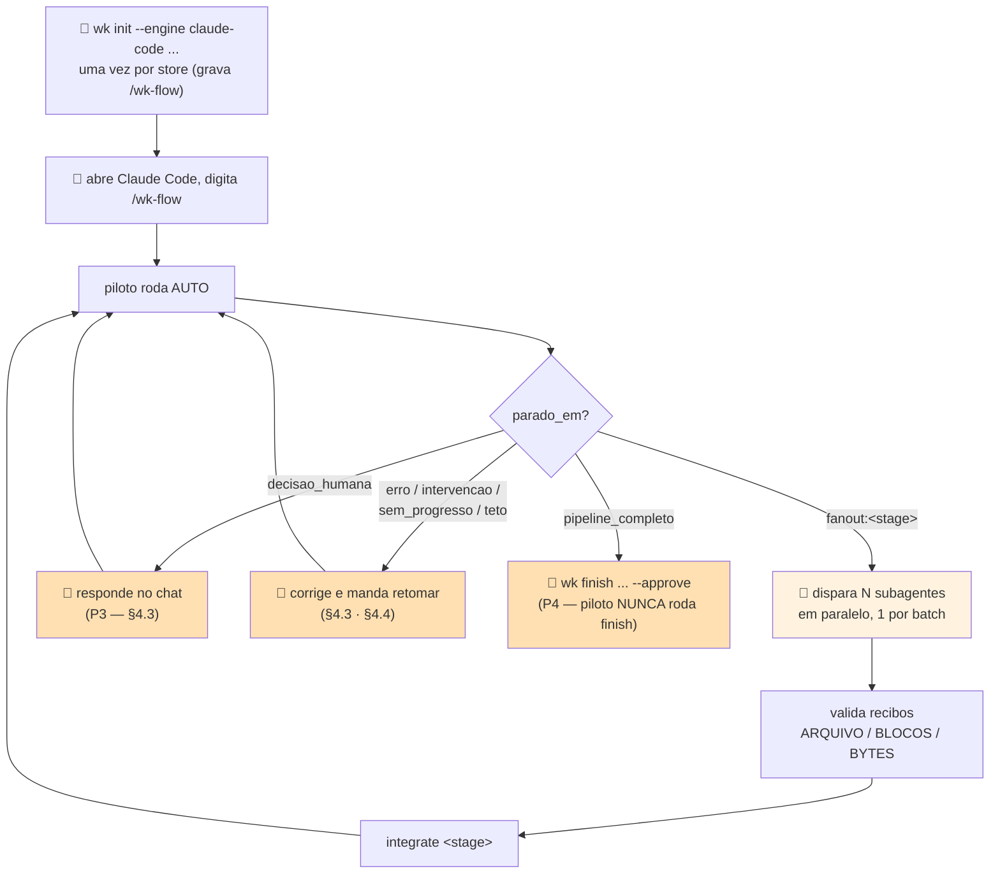

# Wiki AI — Guia de operação

Seis fluxos operacionais. Cada um é uma tabela sequencial: você executa a linha, confere o sinal de "deu certo quando", passa para a próxima. Referência técnica, guardrails e catálogo de erros ficam nas seções 7–9 — fora do caminho.

---

## 0. Antes de começar

### Legenda

| Símbolo | Quem | O que significa |
|---|---|---|
| 👤 | humano | executa o comando no terminal. Tudo que é determinístico é do humano |
| 🤖 | LLM | **colar o prompt impresso pelo `wk` numa sessão de agente COM ACESSO AO DISCO desta máquina** (ex.: Claude Code, ou a engine configurada no FLUXO 0), aberta em qualquer pasta. Nunca um chat web sem acesso a arquivos — os subagentes precisam LER packs e GRAVAR outputs em caminhos locais. Usada SOMENTE onde há análise de conteúdo: análise de asset binário, síntese de resposta, e o modo manual (avançado) do FLUXO 3 |

A LLM não executa nenhum comando `wk`, exceto no modo piloto do FLUXO 3, onde a própria LLM despachante roda `wk code auto`/`integrate` dentro do laço (§4.1) — em todo o resto, todo insumo que a LLM precisa (o que analisar, onde gravar, em que formato) é gerado antes, por script, pelo humano.

### Variáveis usadas em todos os comandos

```bash
WKPY="python"
WK="C:/Users/User/projetos/wiki-ai/wk.pyz"
WK_STORE="C:/caminho/do/store"
WK_REPO="C:/caminho/do/repo"
WK_TOPIC="codebases/nome-do-repo"
```

---

## 1. FLUXO 0 — Setup (uma vez por máquina)

| P# | Quem | O que fazer | O que acontece | Deu certo quando |
|---|---|---|---|---|
| P1 | 👤 | `$WKPY "$WK" doctor --store "$WK_STORE" --repo "$WK_REPO" --engine claude-code` | diagnostica shell, python, `wk`, store, repo, engine | lista de `bloqueios` (pode vir cheia — é o retrato inicial) |
| P2 | 👤 | `$WKPY "$WK" init --engine claude-code --store "$WK_STORE" --repo "$WK_REPO"` | materializa a skill em disco, grava as permissões da engine **e** o slash command `/wk-flow` (`.claude/commands/wk-flow.md`, para `--engine claude-code`) — a entrada do FLUXO 3 | `.claude/settings.json` escrito com `permissions`; JSON de saída traz a chave `comando_wk_flow` confirmando o slash command escrito |
| P3 | 👤 | `$WKPY "$WK" store init "$WK_STORE"` | cria `inbox/`, `raw/`, `wiki/` | estrutura do store criada |
| P4 | 👤 | `$WKPY "$WK" doctor --store "$WK_STORE" --repo "$WK_REPO" --engine claude-code` | rediagnostica; acusa `/wk-flow` ausente/desatualizado (com `acao`) na mesma chave `comando_wk_flow` | **`bloqueios: []`** |

Engines aceitas em `--engine`: `claude-code` · `antigravity` · `devin` · `copilot` · `all` (vírgula para vários). Detalhes do que o `init` escreve: §7.5.

---

## 2. FLUXO 1 — Ingerir texto (transcrição / nota)

Formatos: `.md` · `.txt` · `.vtt` · `.srt` · `.html` · `.xml` · `.xmi` · `.json` (convertidos para Markdown). **Zero passos de LLM.**

| P# | Quem | O que fazer | O que acontece | Deu certo quando |
|---|---|---|---|---|
| P1 | 👤 | `$WKPY "$WK" ingest "C:/caminho/arquivo.md" --source-type human-transcript --origin "reunião 2026-08-07" --topic pagamentos --store "$WK_STORE"` | converte para Markdown com frontmatter de proveniência em `inbox/transcripts/` | JSON com `id`, `path`, `source_type` |
| P2 | 👤 | `$WKPY "$WK" promote --approve-all --source-type human-transcript --topic pagamentos --approved-by "seu-nome" --store "$WK_STORE"` | move de `inbox/` para `raw/` com `promoted_by` | `promovidos[]` preenchido, sem `duplicados[]` |
| P3 | 👤 | `$WKPY "$WK" compile pagamentos --store "$WK_STORE"` | gera as páginas de `wiki/<topic>/` e regrava `wiki/index.md` | `paginas[]` preenchido, `recusados` ausente |
| P4 | 👤 | `$WKPY "$WK" index reindex --store "$WK_STORE"` | reindexa o store | `documents`/`changed`/`pruned`/`embedded` no JSON |
| P5 | 👤 | `$WKPY "$WK" lint --store "$WK_STORE"` | audita e escreve `wiki/_lint-report.md` | `achados: 0` (ou achados conhecidos e aceitos) |

---

## 3. FLUXO 2 — Ingerir documento binário (`.docx` / `.xlsx` / `.csv` / `.pdf`)

O binário não é convertido: é guardado imutável em `raw/assets/<id>.<ext>` e a análise vira uma fonte `agent-output` separada.

| P# | Quem | O que fazer | O que acontece | Deu certo quando |
|---|---|---|---|---|
| P1 | 👤 | `$WKPY "$WK" ingest "C:/caminho/planilha.xlsx" --source-type human-doc --origin "planilha de tarifas" --topic pagamentos --store "$WK_STORE"` | guarda o original em `raw/assets/<id>.xlsx` e cria a página de fonte no `inbox/` | JSON com `id` **e** `asset` |
| P2 | 🤖 | cole o prompt abaixo numa sessão de agente com acesso ao disco | a LLM lê o asset e grava `C:/caminho/analise.md` | recibo `ARQUIVO: <caminho> / BYTES: <n>` e o `.md` existe no disco |
| P3 | 👤 | `$WKPY "$WK" ingest "C:/caminho/analise.md" --source-type agent-output --origin "análise de planilha.xlsx" --topic pagamentos --derived-from "<id-do-asset>" --store "$WK_STORE"` | ingere a análise com linhagem de proveniência | JSON com `id` e `derived_from` |
| P4 | 👤 | `$WKPY "$WK" promote --approve-all --source-type agent-output --topic pagamentos --approved-by "seu-nome" --store "$WK_STORE"` | promove para `raw/` | `promovidos[]` preenchido, sem `bloqueio: realimentacao` |
| P5 | 👤 | `$WKPY "$WK" compile pagamentos --store "$WK_STORE"` | compila a wiki do tópico | `paginas[]` preenchido |
| P6 | 👤 | `$WKPY "$WK" index reindex --store "$WK_STORE"` | reindexa | contagens no JSON |

Prompt do P2:

```
Leia C:/caminho/do/store/raw/assets/<id>.xlsx
Escreva C:/caminho/analise.md em PT-BR técnico.
Toda afirmação confirmada exige arquivo:linha ou célula de origem.
Sem prosa decorativa, sem preâmbulo, sem resumo.
Devolva só: ARQUIVO: <caminho> / BYTES: <n>
```

`--derived-from` no P3 é opcional na CLI, mas é o que alimenta o `L4_realimentacao` do `lint` e o gate `realimentacao` do `promote` — ver §7.6.

---

## 4. FLUXO 3 — Ingerir codebase

### 4.1 Como funciona

O caminho principal é o **modo piloto**: uma LLM despachante (Claude Code, via slash command) roda o pipeline inteiro sozinha, do primeiro `surface` ao `pipeline_completo`, e só devolve o controle ao humano em decisão-chave ou falha. O humano não copia nem cola prompt nenhum — digita `/wk-flow` uma vez e volta a aparecer só quando é chamado.

Por baixo, nada mudou: é a mesma máquina de estados de 8 etapas (`surface → modules → rules → architecture → specs → evidence → synth → verify`) e os mesmos gates de sempre (§7.3). `wk code auto` continua sendo o motor — ele encadeia sozinho as ações determinísticas e para em `fanout:<stage>` porque o próximo passo é conteúdo escrito por LLM, não um comando. O que o modo piloto faz é mover para dentro da LLM despachante a ponte que antes era manual: ler a parada, disparar os subagentes do fan-out (em paralelo), validar os recibos, rodar `integrate`, rodar `auto` de novo — em laço, até bater numa parada que exige o humano.



Quem não usa Claude Code (outra engine, ou quer colar o prompt manualmente): `wk code pilot --store "$WK_STORE" --repo "$WK_REPO"` imprime o mesmo protocolo como prompt-mestre pronto para colar em qualquer sessão de agente com acesso ao disco; `wk code pilot --command-file --store "$WK_STORE" --repo "$WK_REPO"` imprime o conteúdo exato do slash command (o que `wk init` já grava em `.claude/commands/wk-flow.md`).

### 4.2 Passo a passo

Prefixo comum dos comandos 👤: `$WKPY "$WK" code --repo "$WK_REPO" --store "$WK_STORE"`.

| P# | Quem | O que fazer | O que acontece | Deu certo quando |
|---|---|---|---|---|
| P1 | 👤 | `$WKPY "$WK" init --engine claude-code --store "$WK_STORE" --repo "$WK_REPO"` — uma vez por store | grava as permissões da engine e o slash command `/wk-flow` (`.claude/commands/wk-flow.md`) | JSON de saída traz `permissoes[]` preenchido e a chave `comando_wk_flow` confirmando o slash command escrito |
| P2 | 👤 | abrir uma sessão Claude Code no diretório de trabalho e digitar `/wk-flow` | o piloto roda `code auto` em laço: dispara os subagentes de cada fan-out em paralelo, valida os recibos, roda `integrate`, revalida com `auto` — passa sozinho por `surface → modules → rules → architecture → specs → evidence → synth → verify`, sem intervenção | a sessão mostra o progresso avançando estágio a estágio até parar numa das linhas da tabela §4.3 |
| P3 | 👤 | quando o piloto parar em `decisao_humana`: responder no chat (tópico / `doc_level` / `granularity` / unidades de `specs`) — o piloto mostra uma tabela-resumo e as opções válidas antes de perguntar | o piloto embute a resposta no próximo `auto` e retoma o laço | novo `parado_em` diferente de `decisao_humana` |
| P4 | 👤 | quando o piloto parar em `pipeline_completo`: rodar o `wk finish --workdir <workdir> --topic "$WK_TOPIC" --repo "$WK_REPO" --store "$WK_STORE" --approved-by "seu-nome" --approve` que o piloto entrega pronto no campo `acao` (o piloto NUNCA roda `finish` sozinho) | `evidence` (se preciso) → `verify` → `audit` → `publish` → `promote --approve-all` → `compile` → `index reindex` → `lint` (+`docx`) | exit **0**, `passos[]` completo com todos `status: "ok"` (`lint`/`docx` podem sair `"aviso"` sem abortar) |

### 4.3 Quando o piloto devolve o controle

| Parada | Quando acontece | O que o humano faz |
|---|---|---|
| `decisao_humana` | falta uma decisão-chave: tópico, `doc_level`+`granularity`, ou unidades de `specs` | responde no chat, dentro da mesma sessão — P3 acima |
| `erro` | uma ação falhou pela 1ª vez; o piloto tenta **1 correção automática** antes de parar | se o piloto não resolveu sozinho, corrige o que o payload de erro aponta e pede para retomar (o piloto usa `code auto --retry`) |
| `intervencao` | a MESMA falha se repetiu 2x seguidas na MESMA etapa — o `auto` já parou de insistir | corrige pelos `comandos_redo` do payload (ou pelo que `erro` aponta) e pede para retomar (`auto --retry`, que zera o contador de tentativas) |
| `sem_progresso` | a mesma ação saiu 0 sem mover a máquina de estados | pede ao piloto para rodar `code state`/`code next` e investigar antes de retomar |
| teto de 40 ações do piloto | proteção contra laço da LLM despachante (independente do teto de 30 ações de uma invocação do `auto` — esse o piloto absorve sozinho) | revisa o `progresso` reportado; retoma digitando `/wk-flow` de novo (§4.4) ou investiga primeiro |
| `pipeline_completo` | todos os estágios SDD fechados | roda o `wk finish ... --approve` que o piloto entrega — P4 acima |

### 4.4 Retomada e falhas

`code auto` é *stateful* — o checkpoint vive em `state.json`, dentro do workdir (`$WK_STORE/.codescan/<repo>-<hash>`). Isso vale tanto rodando pelo piloto quanto pelo modo manual.

| Situação | O que fazer |
|---|---|
| Sessão caiu no meio do laço | digite `/wk-flow` de novo — o piloto reencontra o ponto exato pelo `state.json` e continua; não há passo a "desfazer" nem flag de retomada |
| Depois de responder uma `decisao_humana` | nada extra: o piloto já embutiu a resposta e voltou ao laço sozinho |
| Depois de corrigir um `erro`/`intervencao` | o piloto usa `code auto --retry`, que zera o contador de tentativas do loop de erro |
| Quer só inspecionar sem alterar nada | `$WKPY "$WK" code --repo "$WK_REPO" --store "$WK_STORE" state` (ou peça ao piloto para rodar) |
| Commit do repo mudou desde o `surface` | `verify` acusa `drift_detectado: true`; `code drift` compara o commit pinado em `surface.json` com o HEAD atual, lista `arquivos_alterados`/`artefatos_afetados` e o `redo` exato por item |
| Refazer 1 item específico | `code redo <stage> --item <item>` — arquiva os artefatos anteriores em `agent-runs/superseded/<run-id>/` antes de sobrescrever |
| Item impossível de completar | `code blocked <stage> --item <item>` (ou `failed`, `degraded`) |

**Proibido abrir `wk.pyz` com zipfile/decompilação para entender um erro.**

### 4.5 Modo manual (avançado)

Existe para engines sem slash command, ou para quem quer controle fino passo a passo. É o mesmo motor do modo piloto (`auto` + os compostos/atômicos de §7.4) sem a LLM despachante fazendo a ponte: você lê cada parada e age.

| Situação | Comando |
|---|---|
| Rodar o `auto` manualmente (a 1ª vez leva as decisões conhecidas) | `$WKPY "$WK" code --repo "$WK_REPO" --store "$WK_STORE" auto --topic "$WK_TOPIC" --doc-level detalhado --granularity module` |
| `auto` parou em `fanout:<stage>` | copie TUDO a partir da linha `Fan-out do estágio <stage>. Você é despachante:` (impressa abaixo da linha JSON) e cole numa sessão de agente com acesso ao disco — nunca um chat web sem acesso a arquivos |
| Depois do fan-out | rode `auto` de novo — ele integra os batches, fecha o estágio e imprime o próximo prompt (ou vá direto ao ponto: veja §7.4 para `run <stage>` / `handoff <stage>` / `integrate <stage>` isolados) |
| `specs` exige a flag na invocação que fecha `architecture` | `auto --specs-items "a,b"` |
| Pipeline fechou | `parado_em: "pipeline_completo"` traz o `wk finish ... --approve` pronto — mesmo P4 de §4.2 |
| Imprimir o mesmo protocolo do piloto como texto (para colar você mesmo, sem slash command) | `wk code pilot --store "$WK_STORE" --repo "$WK_REPO"` (ou `--command-file` para o conteúdo do slash command) |

Contrato bruto de `auto` (campo `parado_em`, o que o modo manual precisa interpretar sozinho — o piloto já faz essa leitura por você):

| `parado_em` | Exit | Significa |
|---|---|---|
| `decisao_humana` | 0 | falta uma decisão-chave (topic / doc-level+granularity / specs-items); a `acao` traz a flag que resolve |
| `fanout:<stage>` | 0 | o próximo passo é colar o prompt impresso na LLM despachante |
| `pipeline_completo` | 0 | todos os estágios SDD fechados; a `acao` já traz o `wk finish ... --approve` pronto |
| `limite_de_acoes` | 0 | teto de 30 ações numa invocação (proteção contra laço); rode `auto` de novo |
| `erro` | 2 | uma ação falhou pela 1ª vez com esta assinatura; corrija e rode `auto` de novo |
| `intervencao` | 2 | a MESMA falha se repetiu 2x seguidas na MESMA etapa — corrija e rode `auto --retry` |
| `sem_progresso` | 2 | a mesma ação saiu 0 sem mover a máquina de estados; rode `state`/`next` e investigue |

Toda saída de `auto` carrega também `executados[]` (o que ESTA invocação rodou) e `progresso` (`"etapa <i> de 8 — fase <...>"`). Detalhes de contrato/citação/gates: §7.1–§7.3. Comandos atômicos de controle fino (retomar 1 batch, inspecionar antes de integrar, repetir 1 item): §7.4.

---

## 5. FLUXO 4 — Consultar a wiki

| P# | Quem | O que fazer | O que acontece | Deu certo quando |
|---|---|---|---|---|
| P1 | 👤 | `$WKPY "$WK" index status --store "$WK_STORE"` | mostra o estado do índice | JSON com as contagens do índice |
| P2 | 👤 | `$WKPY "$WK" index reindex --store "$WK_STORE"` | reindexa antes de buscar | `documents`/`changed`/`pruned`/`embedded` |
| P3 | 👤 | `printf 'intent: como funciona o retry\nlex: retry dead-letter\n' \| $WKPY "$WK" index search -c wiki -n 5 --format json --store "$WK_STORE"` | busca híbrida | `results[]` com os docids |
| P4 | 👤 | `$WKPY "$WK" index get "<docid>" --store "$WK_STORE"` | recupera o documento/trecho | conteúdo do doc no stdout |
| P5 | 🤖 | transforma os `results` em resposta de prosa | — | resposta redigida |
| P6 | 🤖 | grava a resposta em `C:/caminho/resposta.md` | — | o arquivo existe no disco |
| P7 | 👤 | `$WKPY "$WK" ingest "C:/caminho/resposta.md" --source-type agent-output --origin "resposta a: <pergunta>" --topic pagamentos --derived-from "<ids-das-fontes-citadas>" --store "$WK_STORE"` | ingere a resposta com linhagem | JSON com `id` e `derived_from` |
| P8 | 👤 | `$WKPY "$WK" promote --approve "<id-da-resposta>" --approved-by "seu-nome" --store "$WK_STORE"` | aprova só esse item | `promovidos[]` com 1 item |
| P9 | 👤 | `$WKPY "$WK" compile pagamentos --store "$WK_STORE"` | recompila a wiki do tópico | `paginas[]` preenchido |

`--approve` exige o alvo (id ou caminho em `inbox/`) como VALOR da flag; a aprovação em massa é `--approve-all --source-type <t> --topic <x> --approved-by <p>` (§7.6).

Sem embeddings configurados, `vec:` e `hyde:` falham com `exit 2` (`vec/hyde exigem embeddings; índice em modo léxico`); só `lex:` funciona. Para forçar modo léxico ao reindexar: `index reindex --lex-only`.

---

## 6. FLUXO 5 — Auditoria e integridade

| P# | Quem | O que fazer | O que acontece | Deu certo quando |
|---|---|---|---|---|
| P1 | 👤 | `$WKPY "$WK" index status --store "$WK_STORE"` | estado do índice | JSON com as contagens |
| P2 | 👤 | `$WKPY "$WK" index audit --store "$WK_STORE"` | regras determinísticas `L1_canonico_so_de_agente`, `L2_proveniencia_ausente`, `L5_supersedida_ainda_citada` (+ `L4_realimentacao`) | lista de achados por regra |
| P3 | 👤 | `$WKPY "$WK" lint --store "$WK_STORE"` | audita o índice e escreve `wiki/_lint-report.md`; inclui `W1_link_quebrado`, `W2_wikilink_sem_pagina`, `W3_pagina_orfa` | `achados: 0` ou lista de achados |
| P4 | 🤖 | revisa contradição entre fontes (o que seria "L3") | julgamento de conteúdo | contradições resolvidas nas fontes |
| P5 | 👤 | corrige achados L1/L2/L4/L5/W1/W2/W3 | correções mecânicas | `lint` volta a `achados: 0` |

"L3" (contradição) **não é emitido por nenhum comando** — está deliberadamente fora do `index audit` porque exige julgamento semântico. É o único ponto 🤖 deste fluxo.

`L4_realimentacao` (dentro do `lint` e do `index audit`) é 100% mecânico: percorre a cadeia `derived_from` do frontmatter (gravada por `ingest --derived-from`) e acusa quando ela só alcança `agent-output`/página da wiki, nunca uma fonte humana ou `code-repo` — sem leitura de prosa. É o mesmo cálculo que bloqueia `promote` (§8, `bloqueio: realimentacao`); no lint ele reaparece para pegar casos que já passaram pelo `promote` antes da regra existir.

---

## 7. Referência técnica

### 7.1 Contrato entregue à LLM

`compact_contract` — fonte de verdade em runtime: `code sdd-brief <stage>`. São os limites **informados no prompt**, não os gates que decidem sucesso/falha (§7.3).

| Estágio | Bloco | Ids aceitos | Máx linhas/bloco | Seções exigidas |
|---|---|---|---|---|
| modules | `=== MODULE: <path> ===` (e `=== FAILED MODULE: ... ===`) | paths do batch | 56 | Responsabilidade · Estruturas de dados · Fluxos · Dependencias · Rastreabilidade · Lacunas |
| rules | `=== RULES: <id> ===` | `domain` · `state-machines` · `permissions` · `adrs/NNN-<slug>` | 80 | Regras · Estados · Permissoes · Contradicoes · Lacunas |
| architecture | `=== ARCHITECTURE: <id> ===` | `architecture` · `c4-context` · `c4-containers` · `c4-components` · `erd-complete` · `traceability/spec-impact-matrix` · `sequences/<slug>` | 90 | Containers · Integracoes · Decisoes · Riscos · Rastreabilidade |
| specs | `=== SPEC: <unit> ===` (**SPEC singular**) | units do `pending` + `confidence-report` · `gaps` · `traceability/code-spec-matrix` · `user-stories/<slug>` · `openapi/<slug>` | 70 (por arquivo) | Requisitos · Criterios · Design · Tarefas · Testes · Rastreabilidade · Lacunas |
| synth | `=== SYNTH: <id> ===` | `confirmed` · `inferred` (não use `=== CONFIRMED: ===`) | 80 | Confirmados · Inferidos · Perguntas |

Todo bloco fecha com `=== END ===`. Em `specs`, o corpo da unit é dividido por `--- requirements.md ---`, `--- design.md ---`, `--- tasks.md ---` (e, em `doc-level detalhado`, os opcionais `--- contracts.md ---` e `--- edge-cases.md ---`).

Globais do `compact_contract`: 8 seções por artefato · 8 bullets por seção · 0 linhas de código · sem preâmbulo, sem resumo, sem diff. Marcadores obrigatórios: 🟢 confirmado · 🟡 inferido (com justificativa) · 🔴 desconhecido (com pergunta objetiva). Mermaid obrigatório em `architecture` (`flowchart`/`graph`), `c4-*` (`flowchart`/`graph`/`C4Context`/`C4Container`/`C4Component`) e `erd-complete` (`erDiagram`); sem diagrama, `<!-- no-diagram: <motivo> -->`.

### 7.2 Regras de citação, id de bloco e entidades

**Citação (literal no prompt de despacho):** todo bullet 🟢 confirmado exige citação com caminho relativo COMPLETO a partir da raiz do repo, com `/`, exatamente como em `evidence[].path` do pack, seguido de `:linha`. Válido: `quote-service/src/main/java/br/com/acme/insurance/quote/domain/event/DomainEvent.java:5`. Inválido: `DomainEvent.java:5` (basename — reprovado no gate de `verify`/`audit`; vira `caminho_parcial` se o basename casar com exatamente 1 arquivo do repo, `arquivo_inexistente` caso contrário).

**Id de bloco `MODULE`:** o `<id>` tem que ser o path do item do batch (o mesmo que está em `pending` / no `modules-batch-NN.json`). Encurtamento por SUFIXO ÚNICO é mapeado automaticamente (ex.: `domain/event` casa com `quote-service/.../domain/event` se for o único candidato do batch); sufixo ambíguo (casa com mais de um item) ou id que não corresponde a nenhum item do batch vira erro no merge — `id de bloco fora do batch do plano`, com a lista dos ids válidos. `FAILED MODULE` segue a mesma regra.

**Estruturas de dados (bloco `modules`):** nomes de entidade/tipo vão entre crases (ex.: `` `Quote` ``) — não conta como eco de código (a proibição cobre trecho/linha, não identificador entre crases). Alimenta `sdd/data-dictionary.md`, extraído automaticamente no merge de `modules`; sem crases, a entidade pode não ser reconhecida.

### 7.3 Gates determinísticos

O que de fato aprova ou reprova. Aplicados em `integrate`/`merge-agent-output` (`done`) e em `audit`/`verify` — mais amplos que o contrato de §7.1.

| Gate | Onde | Critério |
|---|---|---|
| Fan-out real | merge | N agentes distintos quando o estágio tem mais de 1 batch (evita 1 agente fingindo ser 2) |
| Artefatos obrigatórios | merge | o `doc-level` define o mínimo (`essencial` < `completo` < `detalhado`) — travado antes do fan-out |
| Score ≥ 90 | merge / audit | aderência agregada (citações/seções/tamanho); 89 = falha |
| Mermaid válido | merge / audit | diagrama obrigatório em `architecture`/`c4-*`/`erd-complete`; sem ele, `<!-- no-diagram: <motivo> -->` |
| Proveniência sha256 | merge | sha256 do run registrado em `agent-runs/` |
| Amostra de citações contra o disco | audit | os mesmos gates do merge, mais uma amostra de `arquivo:linha` validada contra o disco real — não confia no texto sozinho |
| Cobertura por artefato | verify | `stages.verify.artifacts`; `sdd/confirmed.md` sempre exigido, `sdd/inferred.md` exigido só se existir no workdir |
| Drift | verify / drift | o commit pinado em `surface.json` (`git.head`) mudou desde a análise → a citação `arquivo:linha` não prova mais nada. Citação para arquivo alterado vira ERRO `drift_detectado`; drift que não toca arquivo citado é só warning |
| Compactação de output | merge | máx. 220 linhas por batch, ajustável por `WK_AGENT_OUTPUT_MAX_LINES` — rejeita eco de instrução / repetição de contexto |

Falhou algum gate → o erro traz `blockers[].action`/`acao`; corrija (👤 mecânico, ou cole novo prompt na LLM se for conteúdo) e rode `auto` (ou `integrate`) de novo.

### 7.4 Comandos atômicos de controle fino

Use quando precisar de granularidade que os compostos não dão (retomar 1 batch específico, inspecionar antes de integrar, repetir só 1 item).

| Comando | Substitui, dentro de | Para quê |
|---|---|---|
| `code run <stage>` | `auto` (só a preparação de 1 fan-out) | prepara packs + `<stage>-contract.json` + manifesto e imprime o prompt de despacho, sem deixar `auto` decidir sozinho quando repetir — útil para retomar depois de fechar o terminal |
| `code integrate <stage> [--partial]` | `auto` (só a integração de 1 fan-out) | integra **todos** os batches do manifesto (`merge-agent-output` de cada um, pelo `agent_slot`) + `done <stage>` de UM estágio, sem deixar `auto` avançar para o próximo; `--partial` integra só os batches cujo output já existe (sem ele, output faltando aborta antes do 1º merge) |
| `code run-stage <stage>` | `run <stage>` (só a 1ª metade) | gera packs + manifesto + `<stage>-contract.json`, sem imprimir o prompt |
| `code handoff <stage>` | `run <stage>` (só a 2ª metade) | reimprime o prompt de despacho de um `run-stage` já feito |
| `code merge-agent-output <stage> --input <arquivo> --agent <slot>` | `integrate <stage>` (1 batch por vez) | integra um batch específico, sem rodar `done` |
| `code done <stage>` | `integrate <stage>` (só o fechamento) | fecha o estágio depois de já ter mergeado todos os batches à mão |
| `code evidence --topic <t>` + `code done evidence` | `auto`/`finish` (passo evidence) | gera o evidence-pack e fecha o estágio manualmente |
| `code auto --retry` | — (dentro do próprio `auto`) | zera o contador de tentativas do loop de erro depois de corrigir uma `intervencao` |
| `code pilot [--command-file]` | modo piloto (`/wk-flow`) | só GERA TEXTO, não executa nada: sem `--command-file`, imprime o prompt-mestre do protocolo piloto pronto para colar; com `--command-file`, imprime o conteúdo exato de `.claude/commands/wk-flow.md` |
| `code verify --artifact <path>` | `finish` (passo verify) | roda só a verificação, isolada, contra um artefato específico |
| `code audit` | `finish` (passo audit) | roda só a auditoria P0 do workdir |
| `code drift` | — | compara commit pinado × HEAD atual; lista artefatos afetados + `redo` por item |
| `code redo <stage> --item <item>` | — | refaz 1 item; arquiva os artefatos anteriores em `agent-runs/superseded/<run-id>/` antes de sobrescrever. Sem `--item`, reabre todos os itens `current` do stage |
| `code agent-pack <stage> --batch N` | `run-stage` (1 pack por vez) | gera o pacote determinístico de 1 batch, sem copiar o repo |
| `code sdd-scaffold <stage>` | — | cria o esqueleto dos artefatos SDD do estágio |
| `code cleanup` | — | apaga o clone de um repo remoto, depois do término |
| `publish --workdir ... --topic ...` | `finish` (passo publish) | só publica em `inbox/`, sem promover/compilar |
| `promote --approve-all --source-type ... --topic ... --approved-by ...` | `finish` (passo promote) | só promove, sem compilar/reindexar/lint |
| `compile "$WK_TOPIC" --store "$WK_STORE"` | `finish` (passo compile) | só recompila a wiki do tópico |
| `code next --quiet` / `code state --quiet` | — | diagnóstico: qual o próximo passo / onde parei |

- `verify` grava sozinho o estado do estágio (`done`/`failed`) — não existe passo `done verify` separado.
- `audit --strict` é aceito, mas `--strict` é no-op: os gates P0 já são padrão.
- `publish` nunca bloqueia por `verify` reprovado — só anota `aviso_verify`. O bloqueio real é em `promote`/`compile`/`docx`. Para seguir mesmo assim: `--allow-unverified` (decisão 👤).
- `merge-agent-output`/`integrate` recusam `--agent` genérico (`main`, `self`, `principal`, `orquestrador`, `orchestrator`) — use sempre o `agent_slot` do batch (`modules-b01`).
- `merge-agent-output --input` recusa arquivo com `mtime` anterior ao `agent-runs/<stage>-plan.json`: sobra de tentativa antiga não passa por resposta fresca de subagente.
- Sem `pending`, `rules`/`architecture`/`synth` viram **1 batch único** (`fanout_required: 1`) — aceitável. Em `specs` isso geraria uma unit genérica `"specs"` — por isso `pending`/`--specs-items` é obrigatório lá. Em `modules`, quem popula o pending é o `plan` (sem flag nenhuma); `plan` exclui módulos de teste por padrão (`--include-tests` os traz de volta).
- A preparação do fan-out (`auto`, ou `run <stage>`) só prepara (packs + contrato + manifesto) e imprime o prompt; **nunca gera conteúdo**.

### 7.5 Omissões — guardrails que não têm passo próprio

- **Permissão da engine é escrita, não só documentada.** `wk init --engine <e> --store <s> --repo <r>` grava, no `settings.json` da engine (`.claude/settings.json` para `claude-code`; `.agents/settings.json` para as demais), um merge idempotente em `permissions`: `additionalDirectories` com store e repo, `allow: ["Read(<store>/**)", "Read(<repo>/**)", "Bash(wk *)"]` + **`Write(<store>/.codescan/**/agent-outputs/**)`** (único ponto de escrita de agente no store — buffer do fan-out) e `deny` NOMINAIS por árvore (`raw/`, `wiki/`, `inbox/`) + arquivos (`index.db*`, `log.md`, `quarantine.md`) + artefatos SDD em `.codescan/` (`state.json`, `agent-runs/`, `agent-packs/`, `sdd/`, `modules/`, `surface.json`). Settings antigos com deny amplo (`Write(<store>/**)`, `Edit(<store>/**)`) são **migrados automaticamente** ao rodar `wk init` de novo (`permissoes_migradas: true`); `check`/`doctor` acusam o formato antigo com `acao: "rode wk init ..."`. O enforcement real desses `deny` só é **verificado** para `claude-code`; para `antigravity`/`devin`/`copilot` é **best-effort** (`wk check`/`doctor` reportam `"formato": "best-effort"`).
- **`wk init` também grava o slash command do modo piloto.** `wk init --engine claude-code --store <s> --repo <r>` grava `.claude/commands/wk-flow.md` (o mesmo protocolo de `code pilot --command-file`, com os caminhos já resolvidos). O JSON de saída de `init`/`check`/`doctor` traz a chave `comando_wk_flow`; quando o slash command está ausente ou desatualizado em relação ao que o `.pyz` embute, ela vem acompanhada de `acao` (rode `wk init` de novo).
- **`wk doctor` audita o próprio `.pyz`.** Compara o hash do código-fonte embutido no `.pyz` (`_build_manifest.json`) com um hash recalculado do diretório `scripts/` ao lado do arquivo, quando existe; se divergir, reporta `pyz_desatualizado: true` e `acao: "rode python scripts/build_pyz.py"`. É diagnóstico — nunca vira `bloqueio` nem afeta o exit code.
- **`publish` é idempotente por `doc_id`.** O id é determinístico (`sb-publish-<repo>-<artefato>`, não hash de conteúdo); reexecutar `publish` no mesmo workdir localiza o arquivo já em `inbox/` com esse `doc_id` e regrava (`atualizado: true`) em vez de duplicar. Vale só para o estágio `inbox/`; duplicidade em `raw/` (pós-`promote`) é outro mecanismo (`duplicados[]`, §8).
- **`export --output` não escreve em `<store>/raw` nem `<store>/wiki`.** Esses diretórios só mudam via `wk publish`/`promote`/`compile`; grave em `inbox/`.
- **`.docx` gerado por `wk docx` não pode ser reingerido** — seria proveniência falsa. A fonte é o `.md` correspondente em `raw/`.

### 7.6 Notas de comportamento

- **`promote --approve-all`** exige `--source-type` + `--topic` + `--approved-by` juntos (escopo fechado — sem os três, aprovaria o inbox inteiro). `--approve <alvo>` aprova UM item explicitamente (id ou caminho em `inbox/`) e também exige `--approved-by`. Não há aprovador default.
- **`compile`** poda página órfã de `wiki/<topic>/` por padrão (`--no-prune` desliga), sempre regrava `wiki/index.md` **global** (todas as fontes promovidas, não só as do `--topic`), e reporta `recusados[]` (id/topic com componente de caminho inválido — cada um pula sem travar o resto) e `podados[]` (as páginas removidas).
- **`ingest --derived-from <ids>`** grava a linhagem de proveniência no frontmatter (`derived_from`, separado por vírgula). Alimenta o `L4_realimentacao` do `lint` e o gate `realimentacao` do `promote` — sem ele, uma cadeia de `agent-output` que nunca cita fonte humana/`code-repo` passa despercebida até alguém tentar promovê-la.
- **`wk finish` absorve `evidence`+`done evidence`**: se `stages.evidence.status` do workdir ainda não é `done` (ex.: veio do caminho atômico, sem `auto`), ele gera o evidence-pack e fecha o estágio antes de seguir; se já é `done` (veio de `auto`), pula direto para `verify`. Idempotente entre reexecuções.
- **Sequência do `wk finish`**: `evidence`(+`done evidence`, se preciso) → `verify` (`sdd/confirmed.md`, e `sdd/inferred.md` se existir) → `audit` → `publish` — falha em qualquer um para com exit 2 e `parado_em: "<passo>"`. Depois vem o **ponto de decisão humana**: sem `--approve`, para com exit **3**, `parado_em: "promote"` e `pendentes[]`; nada é promovido. Com `--approve`: `promote --approve-all --source-type agent-output --topic <t>` → `compile` → `index reindex` → `lint` → `docx` (opcional). Falha de `lint`/`docx` não aborta — vira `"status": "aviso"` no passo. Flags: `--allow-unverified` propaga a decisão de seguir mesmo com `verify` reprovado a `promote`/`compile`/`docx` (decisão 👤, registrada no log); `--no-docx` pula o passo opcional de `wiki-docx/`.
- **`--doc-level` / `--granularity`** (`auto` e `config`): `essencial|completo|detalhado` · `module|endpoint|use-case|hybrid|feature|custom`. Ambas obrigatórias, mas hoje só `doc-level` muda os artefatos exigidos. As flags só importam na invocação em que a decisão ainda está pendente; nas seguintes, `auto` ignora quem for repassada (já gravou) e segue. O mesmo vale para `--specs-items` e `--topic`.
- **`WK_AGENT_OUTPUT_MAX_LINES`** (env var) ajusta o limite de linhas do output de subagente; padrão 220. Valor ausente, não-inteiro ou abaixo de 50 é ignorado e cai no padrão.
- **`reindex_modo`** — o reindex automático dentro de `ingest`/`promote`/`compile`/`finish` detecta sozinho as três `AZURE_OPENAI_*` (`_ENDPOINT`/`_API_KEY`/`_EMBED_DEPLOY`): todas presentes → `reindex_modo: "completo"` (com embeddings); qualquer uma ausente → `"lex-only (embeddings não configurados)"`. Não precisa passar `--lex-only` manualmente nesse caminho — só ao chamar `index reindex` direto.
- **`wk search`** aceita `lex:` / `vec:` / `hyde:` por linha; texto livre de UMA linha sem prefixo recebe `lex:` automaticamente.

---

## 8. Erros comuns

| Erro | Comando de correção |
|---|---|
| `P0: artefato ausente após o merge` | use `--store` com caminho absoluto |
| `ruído rejeitado: ...` | o erro traz regra + linha + trecho; corrija só o trecho apontado |
| `Mermaid ... label nao quoted` | o erro traz linha + trecho + padrão; não remova o diagrama |
| `argument stage: invalid choice: 'evidence'` | `code evidence --topic "$WK_TOPIC"` (não é um `CRITICAL_STAGE`) |
| `--agent` genérico recusado | use o `agent_slot` do batch: `modules-b01` |
| `id de bloco fora do batch do plano` | use o path exato do item do batch (ou um sufixo ÚNICO dele) — §7.2 |
| `prosa fora de arquivo SPEC` / `prosa fora de bloco SPEC` | cabeçalho é `SPEC` singular, não `SPECS`; todo conteúdo dentro de `=== SPEC: ... === … === END ===` |
| `prosa fora de bloco SYNTH` | blocos são `=== SYNTH: confirmed ===` e `=== SYNTH: inferred ===` — não `=== CONFIRMED: ===`/`=== INFERRED: ===` |
| `artefato já pertence a outro batch` (`integrate`/`merge-agent-output`) | outro batch já é dono desse artefato; rode `code redo <stage> --item <item-do-dono>` antes de re-mergear, ou corrija o output deste batch para não reivindicar esse artefato |
| `vec/hyde exigem embeddings; índice em modo léxico` | use `lex:` ou defina as três `AZURE_OPENAI_*` |
| `índice não encontrado: ...` (`lint`, exit 2) | store sem `index.db` — `index reindex --store "$WK_STORE"` primeiro |
| `--approve-all exige --source-type` / `--approve-all exige --topic` | passe os dois filtros: `promote --approve-all --source-type <tipo> --topic <topic> --approved-by <pessoa>` |
| `--approve/--approve-all exigem --approved-by` | informe quem assume a aprovação: `--approved-by "<pessoa>"` (vai para `promoted_by` e para o `log.md`) |
| `publish exige --topic` | `publish --workdir ... --topic "$WK_TOPIC" --store "$WK_STORE"` |
| `drift_detectado: true` (`verify`) | commit do repo mudou desde o `surface`; rode `code drift` e refaça os itens afetados |
| `bloqueio: realimentacao` (`promote`) | fonte deriva de saída de agente sem lastro humano; corrija a proveniência (`--derived-from`) ou use `--allow-feedback-loop` (decisão 👤, fica no log) |
| `duplicados: [...]` (`promote`) | id já existe em `raw/`; `promote` não sobrescreve — resolva o conflito de id antes |
| `caminho_parcial` / `arquivo_inexistente` (`verify`/`evidence`) | use o caminho relativo COMPLETO a partir da raiz do repo (o erro sugere o caminho certo quando o basename é único) |
| `parado_em: "intervencao"` (`code auto`) | a MESMA falha se repetiu 2x seguidas na mesma etapa; rode o(s) `comandos_redo` do payload ou corrija o que `erro` aponta, depois `code auto --retry` |
| `parado_em: "sem_progresso"` (`code auto`) | a ação sai 0 sem escrever o artefato esperado; rode `state`/`next`, corrija e rode `auto` de novo |
| `manifesto ausente para <stage>` (`handoff`) | rode `run-stage <stage>` antes de `handoff <stage>` |
| `input ... tem mtime anterior ao plano de fan-out` | o `.txt` é sobra de tentativa antiga; regrave o output DEPOIS do `run-stage` |
| `'<arquivo>' é um .docx gerado por wk docx` | reingira o `.md` de `raw/`, não o `.docx` derivado |

---

## 9. Todos os comandos

**`wk <cmd>`** (18): `docs` · `init` · `check` · `engines` · `doctor` · `store` · `promote` · `compile` · `docx` · `lint` · `ingest` · `publish` · `finish` · `code` · `index` · `search` · `get` · `audit`

**`wk code <cmd>`** (28): `cleanup` · `surface` · `export` · `plan` · `pending` · `config` · `next` · `done` · `blocked` · `failed` · `degraded` · `state` · `read` · `evidence` · `agent-pack` · `merge-agent-output` · `redo` · `run-stage` · `handoff` · `run` · `integrate` · `auto` · `pilot` · `audit` · `sdd-brief` · `sdd-scaffold` · `verify` · `drift`

**`wk index <cmd>`** (5): `reindex` · `search` · `get` · `audit` · `status`

Estágios da máquina de estados (8, nesta ordem): `surface` · `modules` · `rules` · `architecture` · `specs` · `evidence` · `synth` · `verify`

- Com fan-out (🤖 obrigatório): `modules` · `rules` · `architecture` · `specs` · `synth`
- Sem fan-out (👤 sozinho): `surface` · `evidence` · `verify` (mais `export`, `config` e `plan`, que são passos determinísticos e não estágios)
