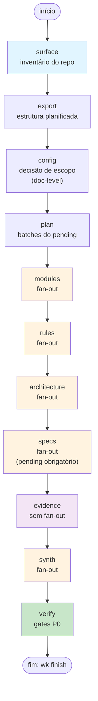
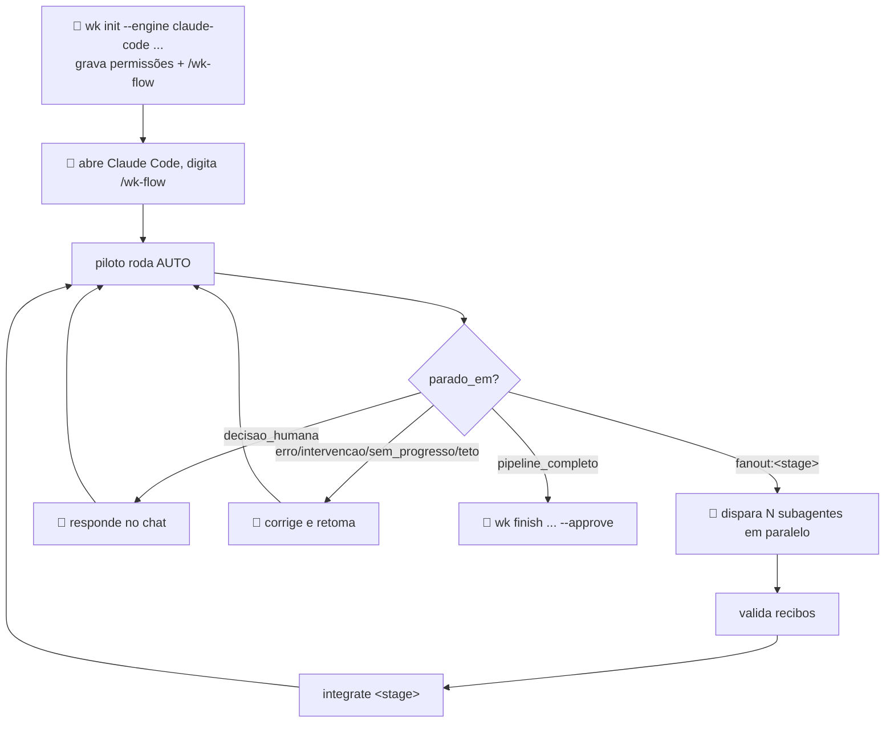

# FLUXO 3 — máquina de estados, modo piloto e porquês

Ingerir codebase: responsabilidade determinística (humano) vs. análise de conteúdo (LLM). Máquina de estados ordena os 8 estágios; o modo piloto move a ponte entre eles para dentro da LLM despachante; gates fecham cada etapa.

## Máquina de estados

## Caminho principal: modo piloto (`/wk-flow`)

Uma LLM despachante roda o pipeline inteiro sozinha. `wk code auto` já encadeia todos os passos determinísticos (`surface`→`export`→`config`→`plan`→`pending`→ prepara fan-out → integra → `evidence`+`done evidence`) e para em `fanout:<stage>` porque escrever conteúdo SDD não é um comando. O modo piloto move essa ponte — ler a parada, disparar os subagentes, validar recibos, integrar, rodar `auto` de novo — para dentro da própria LLM, em laço, devolvendo o controle ao humano só em `decisao_humana` ou falha.

Entrada: `wk init --engine claude-code --store <s> --repo <r>` grava, além das permissões, o slash command `/wk-flow` em `.claude/commands/wk-flow.md` (uma vez por store). Depois disso: abrir Claude Code no diretório de trabalho e digitar `/wk-flow` — o piloto faz o resto sozinho até parar. Sem slash command (outra engine, ou prompt manual): `wk code pilot --store <s> --repo <r>` imprime o mesmo protocolo como texto; `--command-file` imprime o conteúdo exato do slash command.

### Paradas que devolvem ao humano

| Parada | Quando | O humano faz |
|---|---|---|
| `decisao_humana` | falta tópico / `doc_level`+`granularity` / unidades de `specs` | responde no chat; o piloto mostra tabela-resumo + opções válidas |
| `erro` | ação falhou 1ª vez; piloto tenta 1 correção automática antes de parar | corrige o que a `acao` indica; piloto retoma com `auto --retry` |
| `intervencao` | mesma falha 2x seguidas na mesma etapa (`auto` já parou de insistir) | corrige pelos `comandos_redo`/`acao`; piloto retoma com `auto --retry` |
| `sem_progresso` | mesma ação saiu 0 sem mover a máquina de estados | piloto roda `state`/`next`, investiga; humano confirma correção |
| teto de 40 ações do piloto | proteção contra laço da LLM despachante (distinto do teto de 30 ações de UMA invocação do `auto`, que o piloto absorve sozinho) | revisa o `progresso`; digita `/wk-flow` de novo para retomar |
| `pipeline_completo` | todos os estágios SDD fechados | roda o `wk finish ... --approve` que o piloto entrega — piloto NUNCA roda `finish` |

Retomada: `auto` é *stateful* (`state.json` no workdir). Sessão caiu no meio? `/wk-flow` de novo — reencontra o ponto exato, sem passo a desfazer. `code state`/`code next` inspecionam sem alterar nada.

### O passo 🤖 — quando/onde/como (dentro do laço do piloto)

| Pergunta | Resposta |
|---|---|
| QUANDO | `parado_em: "fanout:<stage>"` (5x: modules/rules/architecture/specs/synth); prompt vem impresso abaixo da linha JSON do `auto` |
| O QUE | Da linha `Fan-out do estágio <stage>. Você é despachante:` até o fim |
| ONDE | Dentro da própria sessão do piloto — acesso ao disco desta máquina, nunca chat web sem acesso a arquivos |
| O QUE a LLM faz | Despacha N subagentes EM PARALELO (uma única rodada); cada um lê `<stage>-batch-NN.json`+`<stage>-contract.json`, grava 1 `.txt`; sem `wk`, sem merge |
| COMO saber que terminou | N recibos `ARQUIVO / BLOCOS / BYTES`; piloto confere que os N `.txt` existem antes de integrar |

## Modo manual (avançado)

Existe para engines sem slash command ou controle fino passo a passo — mesmo motor (`auto` + compostos/atômicos abaixo), sem a LLM despachante fazendo a ponte.

| Fase | Quem | Comando composto | Porquê |
|------|------|---|---|
| **1 — Preparar** | 👤 | `surface` | Monta inventário determinístico, trava decisões de escopo antes de fan-out |
| | 👤 | `export` | Planifica módulos/endpoints para o pending |
| | 👤 | `config --doc-level <nível> --granularity <grão>` | Decisão humana de detalhe (essencial/completo/detalhado) |
| | 👤 | `plan` | Popula batches do pending em modules; outros estágios usam pending obrigatório (specs) ou geram 1 batch único |
| **2 — Fan-out ×5** | 👤 | `run <stage>` | Prepara packs + contrato + manifesto, imprime prompt |
| | 🤖 | (cola prompt na LLM) | subagentes escrevem os 5 artefatos |
| | 👤 | `integrate <stage> [--partial]` | Merge determinístico de todos os batches + gates intactos (fan-out real, score ≥90, sha256, mermaid) |
| **3 — Fechar** | 👤 | `finish --approve [--allow-unverified]` | `evidence`+`done evidence` (se ainda não `done`) → verify → audit → publish → promote → compile → lint → docx |

`finish` absorve `evidence`+`done evidence`: se `stages.evidence.status` do workdir já é `done` (rodou via `auto`/piloto, ou à mão antes), pula direto para `verify`; senão gera o pack e fecha o estágio sozinho.

## Gates determinísticos (aplicam em `integrate`/`done` e `audit`/`verify` — em ambos os modos)

| Gate | Determinístico? | Critério | Racional |
|------|---|---|---|
| **Fan-out real** | ✅ | N agentes distintos quando batch count > 1 | Evita consolidação falsa (1 agente fingindo ser 2) |
| **Score ≥ 90** | ✅ | Aderência agregada (citações/seções/tamanho) | Impede síntese superficial; 89 = falha |
| **Artefatos obrigatórios** | ✅ | `doc-level` define mínimo (essencial < completo < detalhado) | Nível de detalhe travado antes do fan-out |
| **Mermaid válido** | ✅ | Diagrama obrigatório em architecture/c4-*/erd-complete | Sem diagrama: `<!-- no-diagram: <motivo> -->` |
| **Proveniência sha256** | ✅ | Citação `arquivo:linha` validada contra disco real | Não confia em texto; verifica linha no git HEAD pinado |
| **Drift detectado** | ✅ | Commit pinado em `surface.json` vs. HEAD atual | Se mudou, citação anterior não prova mais nada; `code drift` lista artefatos afetados |
| **Compactação de output** | ✅ | Max 220 linhas por batch, ajustável `WK_AGENT_OUTPUT_MAX_LINES` | Rejeita eco de instrução / repetição de contexto |

## Contrato de síntese (compact_contract)

Blocos de cada estágio no `<stage>-contract.json`:

| Estágio | Formato bloco | IDs aceitos | Max linhas | Seções |
|------|---|---|---|---|
| modules | `=== MODULE: <path> ===` | caminhos do batch | 56 | Responsabilidade, Estruturas, Fluxos, Dependências, Rastreabilidade, Lacunas |
| rules | `=== RULES: <id> ===` | domain, state-machines, permissions, adrs/NNN-* | 80 | Regras, Estados, Permissões, Contradições, Lacunas |
| architecture | `=== ARCHITECTURE: <id> ===` | architecture, c4-context/containers/components, erd-complete, traceability/*, sequences/* | 90 | Containers, Integrações, Decisões, Riscos, Rastreabilidade |
| specs | `=== SPEC: <unit> ===` | units do pending + confidence-report, gaps, traceability/*, user-stories/*, openapi/* | 70/arquivo | Requisitos, Critérios, Design, Tarefas, Testes, Rastreabilidade, Lacunas |
| synth | `=== SYNTH: <id> ===` | confirmed, inferred | 80 | Confirmados, Inferidos, Perguntas |

Globais: 8 seções/artefato · 8 bullets/seção · 0 linhas de código · Sem preâmbulo/resumo/diff.

## Erro e retomada — referência rápida

- `code next --quiet` — qual o próximo passo determinístico?
- `code state --quiet` — onde parei?
- `code redo <stage> --item <item>` — refaz 1 item, arquiva anteriores em `agent-runs/superseded/`
- `code drift` — compara commit pinado vs. HEAD, lista artefatos afetados + `redo` por item
- Falhou gate → `blockers[].acao` instrui correção; repita estágio
- `code auto` parou em `parado_em: "intervencao"` (mesma falha 2x seguidas na mesma etapa) — rode o(s) `comandos_redo` do payload de erro ou corrija o que `erro` aponta, depois `code auto --retry` para zerar o contador de tentativas e retomar o laço
- `finish --allow-unverified` — propaga decisão humana mesmo com `verify` reprovado (registrado em log)
- No modo piloto, tudo isso acontece dentro do laço da LLM despachante (§ "Paradas que devolvem ao humano" acima); os comandos continuam os mesmos por baixo
