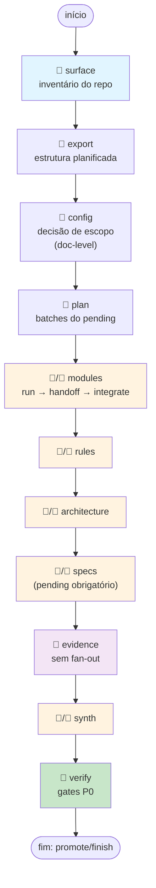

# FLUXO 3 — máquina de estados e porquês

Ingerir codebase: responsabilidade determinística (humano) vs. análise de conteúdo (LLM). Máquina de estados ordena os 8 estágios; 3 fases estruturam o fluxo; gates fecham cada etapa.

## Máquina de estados

## Caminho principal: `wk code auto`

`auto` encadeia sozinho todos os passos determinísticos abaixo — `surface`→`export`→`config`→`plan`→`pending`→ prepara fan-out → integra → `evidence`+`done evidence` — invocação após invocação, até bater numa parada real (`decisao_humana`, `fanout:<stage>`, `pipeline_completo`, `erro`/`intervencao`). 1ª invocação leva `--topic`/`--doc-level`/`--granularity` (e, ao chegar em `specs`, `--specs-items`) para não parar em `decisao_humana`; nas demais, só `auto` — cola o prompt impresso na LLM entre uma invocação e outra. Os comandos compostos/atômicos da tabela abaixo continuam existindo — é o que `auto` chama por baixo — para controle fino/retomada.

## Fases e comandos compostos

| Fase | Quem | Comando composto | Porquê |
|------|------|---|---|
| **1 — Preparar** | 👤 | `surface` | Monta inventário determinístico, trava decisões de escopo antes de fan-out |
| | 👤 | `export` | Planifica módulos/endpoints para o pending |
| | 👤 | `config --doc-level <nível> --granularity <grão>` | Decisão humana de detalhe (essencial/completo/detalhado) |
| | 👤 | `plan` | Popula batches do pending em modules; outros estágios usam pending obrigatório (specs) ou geram 1 batch único |
| **2 — Fan-out ×5** | 👤 | `run <stage>` | Prepara packs + contrato + manifesto, imprime prompt |
| | 🤖 | (cola prompt na LLM) | **Único ponto LLM** do fluxo: subagentes escrevem os 5 artefatos |
| | 👤 | `integrate <stage> [--partial]` | Merge determinístico de todos os batches + gates intactos (fan-out real, score ≥90, sha256, mermaid) |
| **3 — Fechar** | 👤 | `finish --approve [--allow-unverified]` | `evidence`+`done evidence` (se ainda não `done`) → verify → audit → publish → promote → compile → lint → docx |

`finish` absorve `evidence`+`done evidence`: se `stages.evidence.status` do workdir já é `done` (rodou via `auto`, ou à mão antes), pula direto para `verify`; senão gera o pack e fecha o estágio sozinho. Não precisa rodar `evidence`/`done evidence` à mão antes de `finish`.

## Gates determinísticos (apply em `integrate`/`done` e `audit`/`verify`)

| Gate | Determinístico? | Critério | Racional |
|------|---|---|---|
| **Fan-out real** | ✅ | N agentes distintos quando batch count > 1 | Evita consolidação falsa (1 agente fingindo ser 2) |
| **Score ≥ 90** | ✅ | Aderência agregada (citações/seções/tamanho) | Impede síntese superficial; 89 = falha |
| **Artefatos obrigatórios** | ✅ | `doc-level` define mínimo (essencial < completo < detalhado) | Nível de detalhe travado antes do fan-out |
| **Mermaid válido** | ✅ | Diagrama obrigatório em architecture/c4-*/erd-complete | Sem diagrama: `<!-- no-diagram: <motivo> -->` |
| **Proveniência sha256** | ✅ | Citação `arquivo:linha` validada contra disco real | Não confia em texto; verifica linha no git HEAD pinado |
| **Drift detectado** | ✅ | Commit pinado em `surface.json` vs. HEAD atual | Se mudou, citação anterior não prova mais nada; `code drift` lista artefatos afetados |
| **Compactação de output** | ✅ | Max 220 linhas por batch, ajustável `WK_AGENT_OUTPUT_MAX_LINES` | Rejeita eco de instrução / repetição de contexto |

## Contrato de síntese (compact_contract)

Blocos de cada estágio no `<stage>-contract.json`:

| Estágio | Formato bloco | IDs aceitos | Max linhas | Seções |
|------|---|---|---|---|
| modules | `=== MODULE: <path> ===` | caminhos do batch | 56 | Responsabilidade, Estruturas, Fluxos, Dependências, Rastreabilidade, Lacunas |
| rules | `=== RULES: <id> ===` | domain, state-machines, permissions, adrs/NNN-* | 80 | Regras, Estados, Permissões, Contradições, Lacunas |
| architecture | `=== ARCHITECTURE: <id> ===` | architecture, c4-context/containers/components, erd-complete, traceability/*, sequences/* | 90 | Containers, Integrações, Decisões, Riscos, Rastreabilidade |
| specs | `=== SPEC: <unit> ===` | units do pending + confidence-report, gaps, traceability/*, user-stories/*, openapi/* | 70/arquivo | Requisitos, Critérios, Design, Tarefas, Testes, Rastreabilidade, Lacunas |
| synth | `=== SYNTH: <id> ===` | confirmed, inferred | 80 | Confirmados, Inferidos, Perguntas |

Globais: 8 seções/artefato · 8 bullets/seção · 0 linhas de código · Sem preâmbulo/resumo/diff.

## Retomada e erro

- `code next --quiet` — qual o próximo passo determinístico?
- `code state --quiet` — onde parei?
- `code redo <stage> --item <item>` — refaz 1 item, arquiva anteriores em `agent-runs/superseded/`
- `code drift` — compara commit pinado vs. HEAD, lista artefatos afetados + `redo` por item
- Falhou gate → `blockers[].acao` instrui correção; repita estágio
- `code auto` parou em `parado_em: "intervencao"` (mesma falha 2x seguidas na mesma etapa) — rode o(s) `comandos_redo` do payload de erro ou corrija o que `erro` aponta, depois `code auto --retry` para zerar o contador de tentativas e retomar o laço
- `finish --allow-unverified` — propaga decisão humana mesmo com `verify` reprovado (registrado em log)
